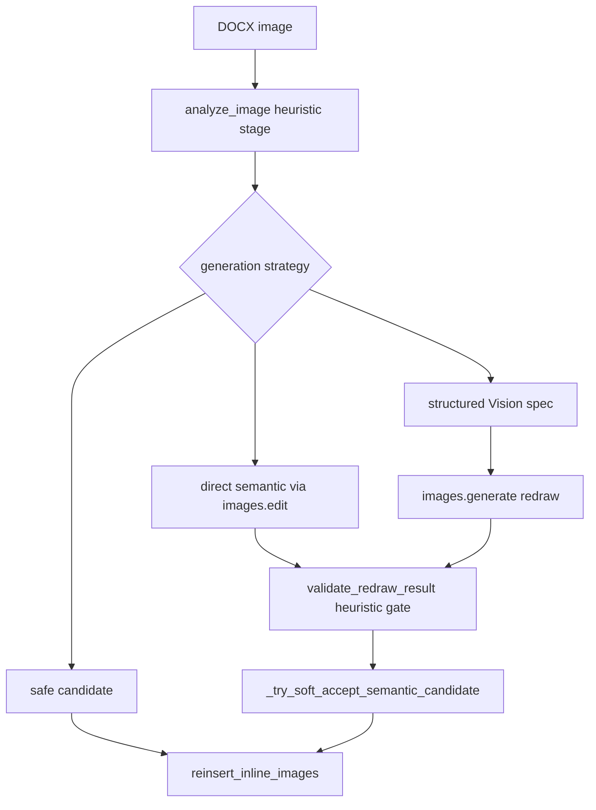

# Код-ревью проекта DocxAICorrector — актуализированный отчёт

**Дата:** 2026-03-09  
**Статус:** обновлено по результатам перепроверки кода  
**Фокус:** архитектура, image pipeline, OpenAI integration, надёжность, согласованность документации

Этот документ заменяет предыдущую версию как более точный технический снимок текущего кода. Предыдущий отчёт был полезным черновиком, но в ряде мест переоценивал impact, содержал устаревшие line references и не отражал несколько важных изменений в реальном pipeline, включая фактическое разделение `semantic_redraw_structured` и `semantic_redraw_direct` в текущей реализации image generation.

---

## Содержание

1. [Critical — 2 бага](#critical)
2. [Warning — 13 проблем](#warning)
3. [Suggestion — 4 улучшения](#suggestion)
4. [Архитектурный анализ](#архитектурный-анализ)
5. [Анализ Image Pipeline и OpenAI](#анализ-image-pipeline-и-openai)
6. [Рекомендуемый план действий](#рекомендуемый-план-действий)
7. [Итоговая оценка актуальности отчёта](#итоговая-оценка-актуальности-отчёта)

---

## Critical

**Всего: 2 бага.**

### 1. `_build_conservative_candidate_analysis()` занижает `contains_text` в fallback-ветке

**Статус:** исправлено 2026-03-09

- **Файл:** `image_validation.py`
- **Функция:** `_build_conservative_candidate_analysis()`
- **Confidence:** высокая

**Проблема:**

В консервативной сборке fallback-анализа поле `contains_text` фактически схлопывается к `False`, даже если исходный анализ фиксировал наличие текста.

**Почему это важно:**

- Это баг именно fallback-пути валидатора, когда внешний `candidate_analysis` не передан.
- Формулировка из предыдущего отчёта про гарантированный слом всего semantic redraw pipeline была слишком жёсткой.
- Реальный impact уже: fallback-анализ может искусственно занизить `_text_match_score()` для текстовых изображений и тем самым сделать строгую валидацию излишне пессимистичной.
- Реальный impact ещё сильнее смягчается тем, что в приложении существует soft-accept путь через `_try_soft_accept_semantic_candidate()`, поэтому строгий validator не является единственной точкой принятия результата.

**Корректная формулировка риска:**

Не гарантированный отказ всего semantic redraw pipeline, а дефект fallback-ветки validator-а, который искажает оценку текстосодержащих candidate-изображений при отсутствии внешнего `candidate_analysis`.

**Направление исправления:**

- либо наследовать `contains_text` от исходного анализа;
- либо явно оставить консервативное занижение, но тогда пересмотреть логику `_text_match_score()` и документировать этот компромисс.

---

### 2. `_clear_paragraph_runs()` удаляет paragraph properties и ломает форматирование при реинсерте

**Статус:** исправлено 2026-03-09

- **Файл:** `document.py`
- **Функции:** `_clear_paragraph_runs()`, `reinsert_inline_images()`
- **Confidence:** высокая

**Проблема:**

Очистка абзаца удаляет все дочерние XML-элементы `<w:p>`, включая `<w:pPr>`. Это значит, что вместе с runs теряются и paragraph properties.

**Последствия:**

- при реинсерте изображений абзац может потерять выравнивание;
- может исчезнуть стиль абзаца;
- могут пропасть отступы и интервалы;
- визуально документ остаётся валидным, но форматирование в проблемных абзацах оказывается повреждено.

**Направление исправления:**

- удалять только runs;
- либо явно сохранять `<w:pPr>` и другие структурные узлы, которые нельзя уничтожать при очистке контейнера.

---

## Warning

**Всего: 13 проблем.**

### 3. В image path нет явного timeout, transient retry и backoff вокруг внешних OpenAI вызовов

**Статус:** исправлено 2026-03-09

- **Файл:** `image_generation.py`
- **Функции:** `_call_images_edit()`, `_call_images_generate()`, `_extract_structured_layout_description()`
- **Confidence:** высокая

В текущем коде уже есть ограниченная логика совместимости SDK/API:

- `_call_images_edit()` повторяет запрос без части optional params;
- `_call_images_edit()` умеет сокращать слишком длинный prompt и подбирать fallback size;
- `_call_images_generate()` делает аналогичную деградацию параметров для `images.generate()`.

Однако это не заменяет полноценный operational resilience layer:

- нет явного timeout для `responses.create()`, `images.generate()` и `images.edit()`;
- нет status-aware retry для `429`, `5xx` и сетевых ошибок;
- нет backoff-политики для transient failures;
- Vision-вызов в structured path обрабатывается без отдельного retry-контура.

**Риск:** pipeline умеет подстраиваться под часть ошибок сигнатуры и ограничений параметров, но остаётся хрупким к сетевым сбоям, rate limiting и подвисаниям внешнего API.

---

### 4. Reuse OpenAI client отсутствует именно в image path

**Статус:** исправлено 2026-03-09

- **Файлы:** `config.py`, `image_generation.py`
- **Функции:** `get_client()`, semantic generation path
- **Confidence:** высокая

Предыдущая формулировка `новый OpenAI client на каждый вызов во всём приложении` была неточной.

**Точнее:**

- проблема в первую очередь относится к image path;
- `get_client()` создаёт новый `OpenAI` client;
- semantic generation вызывает `get_client()` на каждую попытку;
- это затрагивает и direct edit path, и structured path с Vision + `images.generate()`;
- текстовый pipeline в пределах запуска уже переиспользует `client` на уровне orchestration, так что проблема не одинаково выражена во всех ветках приложения.

**Риск:** лишний connection churn и отсутствие единообразной конфигурации timeout/retry именно в image-потоке.

---

### 5. `analyze_image()` и `validate_redraw_result()` остаются эвристическими, а не Vision-based

- **Файлы:** `image_analysis.py`, `image_validation.py`
- **Функции:** `analyze_image()`, `validate_redraw_result()`
- **Confidence:** высокая

Image pipeline использует AI только на стадии генерации изображения. Анализ до генерации и валидация после генерации по-прежнему строятся на эвристиках, а не на Vision/Multimodal сравнении.

Дополнительно параметр `model` в `analyze_image()` фактически не участвует в логике, что создаёт ложное впечатление AI-анализа там, где его нет.

**Риск:** validator оценивает не смысловое совпадение изображения, а согласованность суррогатных признаков.

---

### 6. `ImageAnalysisResult.extracted_labels` фактически остаётся пустым

- **Файл:** `image_analysis.py`
- **Функция:** `analyze_image()`
- **Confidence:** высокая

В текущих ветках анализа `extracted_labels` практически не наполняется содержательными данными и остаётся пустым списком.

**Риск:** label-based validation остаётся слабой и не даёт надёжного сигнала для сравнения original и candidate.

---

### 7. Для `image/png`, `image/gif`, `image/bmp` остаётся сильный heuristic bias

**Статус:** исправлено 2026-03-09

- **Файл:** `image_analysis.py`
- **Confidence:** высокая

Старая формулировка `все PNG = diagram` уже устарела и должна быть смягчена.

**Точнее:**

- в `analyze_image()` появились дополнительные эвристики;
- но для `image/png`, `image/gif`, `image/bmp` всё ещё сохраняется сильный сдвиг в сторону diagram-like интерпретации и permissive поведения для semantic redraw.

**Риск:** некоторые raster-изображения вроде скриншотов или иных визуальных материалов всё ещё могут получать слишком оптимистичную классификацию для semantic redraw.

---

### 8. Soft-accept путь меняет риск-профиль pipeline и должен быть явно отражён в ревью

- **Файл:** `app.py`
- **Функция:** `_try_soft_accept_semantic_candidate()`
- **Confidence:** высокая

В приложении есть отдельная ветка, которая может принять redraw даже после того, как строгий validator не дал полного accept.

**Почему это важно:**

- строгая валидация не является финальным gate;
- риск pipeline определяется не только `validate_redraw_result()`, но и downstream policy в orchestration;
- любая формулировка про validator должна учитывать, что итоговое решение может быть более мягким, чем сам validator.

---

### 9. Повторный анализ semantic candidate может идти со stale MIME type

**Статус:** исправлено 2026-03-09

- **Файлы:** `app.py`, `image_generation.py`
- **Confidence:** высокая

После semantic generation candidate повторно анализируется, но на call-site передаётся исходный `mime_type`, хотя фактический output format может быть принудительно переключён на PNG через `_select_semantic_api_output_format()`.

**Риск:** эвристики повторного анализа могут работать на неверной MIME-предпосылке и тем самым искажать downstream scoring и validation.

---

### 10. `inspect_placeholder_integrity()` в runtime только логирует mismatch

**Статус:** исправлено 2026-03-09

- **Файлы:** `document.py`, `app.py`
- **Функции:** `inspect_placeholder_integrity()`, `run_document_processing()`
- **Confidence:** высокая

Если placeholder теряется или перестаёт совпадать с ожиданиями, текущая обработка ограничивается логированием mismatch.

**Риск:** при фактической потере placeholder-а изображение не будет куда корректно реинсертить, и в итоговом документе оно может просто исчезнуть.

---

### 11. `reinsert_inline_images()` не сохраняет исходные размеры изображения

**Статус:** исправлено 2026-03-09

- **Файл:** `document.py`
- **Функция:** `reinsert_inline_images()`
- **Confidence:** высокая

При вставке изображения используется `add_picture()` без явной передачи `width` и `height`.

**Риск:** итоговый размер может отличаться от исходного, особенно если semantic redraw вернул изображение с другими пиксельными размерами или metadata.

---

### 12. Открытие DOCX остаётся без hardening по размеру и распаковке

**Статус:** исправлено 2026-03-09

- **Файл:** `document.py`
- **Функция:** открытие `Document(uploaded_file)`
- **Confidence:** высокая

DOCX открывается без явного контроля размера входного файла и без дополнительной защиты от zip-bomb сценариев.

**Риск:** зловредный или аномально сжатый файл может привести к избыточному потреблению памяти и деградации сервиса.

---

### 13. В image pipeline нет явного budget/cost control

**Статус:** исправлено 2026-03-09

- **Файл:** `image_generation.py`
- **Функции:** `_generate_direct_semantic_candidate()`, `_generate_structured_candidate()`, `_extract_structured_layout_description()`
- **Confidence:** высокая

У image path нет явного budget cap или cost guard. При этом cost profile стал сложнее:

- direct branch использует `images.edit()`;
- structured branch использует сначала Vision-вызов через `responses.create()`, затем `images.generate()`;
- direct branch при ошибке может fallback-нуться в structured branch;
- high fidelity дополнительно усиливается эвристикой `_uses_high_fidelity_semantic_edit()`.

**Риск:** стоимость image pipeline может расти непрозрачно для пользователя и для runtime policy документа, особенно когда одна попытка semantic redraw фактически превращается в цепочку из двух внешних model calls.

---

### 14. Crash-path worker-а остаётся хрупким из-за отсутствия гарантированного cleanup

**Статус:** исправлено 2026-03-09

- **Файлы:** `app.py`, `processing_runtime.py`
- **Функции:** `_run_processing_worker()`, обработка `worker_complete`
- **Confidence:** высокая

Worker cleanup завязан на событие `worker_complete`, но `_run_processing_worker()` не гарантирует cleanup через `try/finally` на случай неперехваченного исключения.

**Риск:** возможен зависший runtime-state, при котором UI продолжает считать обработку активной или не выполняет корректное завершение фонового прогона.

---

### 15. Тесты не закрывают самые рискованные регрессии pipeline

**Статус:** исправлено 2026-03-09

- **Категория:** test coverage gap
- **Confidence:** высокая

В текущем наборе тестов нет явных регрессий на следующие самые чувствительные сценарии:

- сохранение paragraph properties при `_clear_paragraph_runs()`;
- сохранение размеров при `reinsert_inline_images()`;
- stale MIME на call-site повторного анализа candidate;
- cleanup runtime-state при аварийном краше worker-а.

**Риск:** часть самых неприятных багов может возвращаться незаметно, потому что не закреплена тестами на границах document/image/runtime слоёв.

---

## Suggestion

**Всего: 4 улучшения.**

### S1. `app.py` остаётся перегруженным application layer despite module decomposition

**Статус:** существенно улучшено 2026-03-09

- **Файл:** `app.py`

Модульная декомпозиция в проекте уже есть, однако orchestration всё ещё концентрируется в одном месте. В `app.py` одновременно живут:

- UI orchestration;
- document processing flow;
- image candidate scoring и selection;
- soft-accept policy;
- runtime adapter logic.

`processing_runtime.py` действительно улучшил background UX и вынес часть runtime-механики, но не снял архитектурную перегрузку application layer.

**Направление:** выносить orchestration и image policy в отдельный coordinator/application service слой.

---

### S2. Формулировку про `copy.deepcopy()` нужно держать в зоне object churn, а не агрессивной memory panic

**Статус:** исправлено 2026-03-09

- **Файл:** `app.py`
- **Функция:** `_select_best_semantic_asset()`

Concern по лишнему клонированию остаётся валидным, но старая формулировка про гарантированное мегабайтное дублирование была избыточно жёсткой.

**Корректнее:**

- это прежде всего unnecessary cloning и object churn в retry/select path;
- проблема заслуживает оптимизации, но без драматизации memory impact там, где точные объёмы заранее не доказаны.

---

### S3. Image pipeline нуждается в явном metadata contract

**Статус:** исправлено 2026-03-09

Часть текущих рисков имеет общий источник: pipeline не хранит и не прокидывает в одном контракте критичные свойства candidate-изображения.

В такой контракт стоит явно включить:

- фактический output MIME;
- исходные и целевые размеры для reinsertion;
- outcome строгой валидации;
- факт soft-accept;
- статус placeholder integrity.

Это уменьшит вероятность stale MIME, немого soft-accept и потери изображений на поздних стадиях.

---

### S4. Для дальнейшей документации лучше опираться на function-level references, а не на псевдоточные строки

**Статус:** исправлено 2026-03-09

В предыдущей версии отчёта часть line references уже устарела. Для такого быстро меняющегося кода надёжнее:

- указывать файл и функцию как основную точку привязки;
- добавлять line references только там, где они действительно перепроверены;
- избегать ложной точности, которая делает отчёт менее полезным уже после небольшого рефакторинга.

---

## Архитектурный анализ

### Что улучшилось

- проект уже не выглядит как полностью монолитный single-file prototype;
- отдельные модули для анализа, генерации, валидации, документа и runtime действительно существуют;
- `processing_runtime.py` улучшил background UX и частично отделил событийную механику от UI-потока.
- orchestration для document flow и image flow вынесен из `app.py` в отдельные coordinator-модули.

### Что остаётся архитектурным узким местом

Главный remaining gap теперь не в размере `app.py`, а в качестве и природе сигналов image pipeline:

- `analyze_image()` и `validate_redraw_result()` всё ещё во многом зависят от эвристик;
- quality policy по изображениям уже декомпозирована по модулям, но остаётся ограниченной качеством analysis/validation layer;
- дальнейшее улучшение теперь скорее про качество multimodal signals, чем про разрезание orchestration-файлов.

### Архитектурный вывод

Текущую систему корректно описывать не как `монолит без декомпозиции`, а как `декомпозированный проект с выделенными coordinator-модулями и оставшимся quality-gap в image analysis/validation`.

Это важное уточнение по сравнению с предыдущей версией отчёта.

---

## Анализ Image Pipeline и OpenAI

### Текущий flow

### Что важно понимать про реальный pipeline

1. **Image path больше не сводится к одному AI-вызову**: direct branch идёт через `client.images.edit()`, а structured branch использует Vision-вызов через `client.responses.create()` и затем `client.images.generate()`.
2. **Разделение `semantic_redraw_structured` и `semantic_redraw_direct` уже явно выражено в коде**, и это позитивное архитектурное уточнение по сравнению с более ранним состоянием pipeline.
3. **Analysis и validation не являются Vision-based** — pre-analysis через `analyze_image()` и post-validation через `validate_redraw_result()` по-прежнему heuristic layers.
4. **Strict validator не является единственным финальным gate** — после него существует soft-accept логика.
5. **Candidate metadata сохраняется неполно** — отсюда растут stale MIME и потеря размеров при reinsertion.
6. **Placeholder integrity пока не enforced** — mismatch логируется, но не останавливает сборку результата.

### Главный вывод по quality profile

Текущий image pipeline нельзя описывать как `строгая семантическая проверка AI-результата`. Корректнее говорить так:

- генерация изображения реально использует OpenAI и теперь уже имеет разные product branches для structured и direct redraw;
- до- и пост-анализ результата остаются эвристическими, несмотря на появление Vision внутри structured generation branch;
- итоговое решение о принятии candidate определяется комбинацией strict validator, downstream scoring и soft-accept policy;
- стоимость и operational resilience image path пока недооформлены как first-class constraints.

---

## Рекомендуемый план действий

### P0 — корректность и сохранность документа

1. [x] Исправить fallback-логику `contains_text` в validator-е.
2. [x] Исправить очистку paragraph XML так, чтобы сохранялись paragraph properties.
3. [x] Сохранять исходные размеры изображения при reinsertion.
4. [x] Превратить placeholder integrity mismatch из просто log-сигнала в enforced decision point.

### P1 — устойчивость image pipeline

5. [x] Добавить timeout, status-aware retry и backoff вокруг `client.responses.create()`, `client.images.generate()` и `client.images.edit()`.
6. [x] Ввести reuse OpenAI client для image path.
7. [x] Прокидывать фактический output MIME в повторный анализ candidate.
8. [x] Добавить budget/cost guard для semantic redraw path.
9. [x] Гарантировать cleanup worker-state даже при аварийном исключении.

### P2 — качество сигналов и архитектурная ясность

10. [x] Явно задокументировать `analyze_image()` и `validate_redraw_result()` как heuristic-only до внедрения стабильного Vision-based слоя.
11. [x] Ввести явный metadata contract для image candidate.
12. [x] Вынести orchestration и image decision policy из `app.py` в отдельный application service слой.
13. [x] Закрыть самые рискованные regressions таргетированными тестами.

---

## Итоговая оценка актуальности отчёта

Предыдущая версия `docs/CODE_REVIEW_REPORT.md` была полезным черновиком: она правильно указывала на часть проблем в image pipeline, DOCX reinsertion и архитектурной перегрузке.

Однако как **точный технический снимок текущего кода** она требовала существенного обновления, потому что:

- слишком жёстко описывала impact бага `contains_text`;
- устаревшим образом формулировала PNG-классификацию;
- переоценивала memory impact `copy.deepcopy()`;
- недостаточно точно описывала область проблемы с reuse OpenAI client;
- описывала image path как почти single-call `images.edit` pipeline, тогда как текущий код уже разделяет direct edit и structured Vision + `images.generate` ветки;
- не отражала soft-accept path, stale MIME, placeholder integrity risk, budget concerns и worker crash cleanup fragility;
- местами опиралась на уже ненадёжные line references.

Текущая редакция должна рассматриваться как более корректная и внутренняя согласованная версия ревью по состоянию на момент перепроверки.
