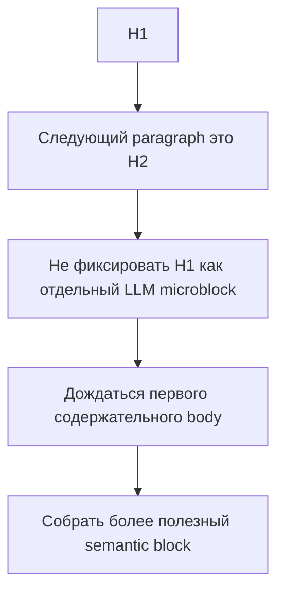

# Спецификация: оптимизация размера запросов через укрупнение semantic block-ов

**Дата:** 2026-03-17  
**Статус:** Частично реализовано в коде, live-validation pending  
**Триггер:** серия UI-прогонов показала избыточное число микрозапросов и повышенную хрупкость pipeline при `empty_response`

---

## 0. Чеклист выполнения

### Реализовано

- [x] Image-only блоки переведены в passthrough-path в [`build_editing_jobs()`](document.py:933): они сохраняются в плане обработки, но не отправляются в LLM.
- [x] Исправлен consecutive heading pattern в [`build_semantic_blocks()`](document.py:813) для цепочки `heading -> heading -> body`.
- [x] Существующее поведение `heading + body` сохранено.
- [x] Добавлены unit-тесты на consecutive heading chain и на image-only passthrough-path.
- [x] Выполнена финальная пользовательски видимая верификация через VS Code task `Run Full Pytest`.

### Не реализовано в рамках v1

- [ ] Общий fallback post-processing merge-pass не реализован.
- [ ] Stabilizing-pass для повторных слияний не реализован.
- [ ] Backward-merge коротких хвостовых блоков не реализован.
- [ ] Отдельная адресная доработка excerpt/context path для исключения image-only блоков из `context_before` / `context_after` не реализована.

### Ещё не подтверждено отдельной целевой проверкой

- [ ] Выполнить UI-прогон на [`tests/sources/Лиетар глава1.docx`](tests/sources/Лиетар%20глава1.docx) и сравнить block map до/после.
- [ ] Подтвердить на реальном документе уменьшение числа model call.
- [ ] Подтвердить на реальном документе исчезновение отдельного heading-microblock в начале consecutive heading sequence.
- [ ] Подтвердить на реальном документе, что частота `empty_response` не выросла и желательно снизилась.

### Что уже покрыто косвенно существующим зелёным suite, но без нового отдельного теста именно под эту задачу

- [x] Image/table placeholder contract не сломан по итогам полного regression suite.
- [x] `heading + body` по-прежнему работает как раньше.
- [x] Image + caption contract не сломан по итогам полного regression suite.
- [x] Длинные body-блоки по-прежнему проходят существующие тесты без регрессии.
- [ ] Отдельный новый targeted test на сохранение image-only semantic block в reconstruction path не добавлялся.

---

## 1. Проблема

Текущее разбиение в [`build_semantic_blocks()`](document.py:813) создаёт микроблоки не повсеместно, а прежде всего в **паттерне consecutive heading**.

Ключевая причина:

```python
if paragraph.role == "heading":
    flush_current()
    append_paragraph(paragraph)
    continue
```

Из-за этого при последовательности `H1 -> H2 -> body` первый заголовок фиксируется как отдельный блок ещё до того, как становится понятно, что он относится к следующему заголовку и последующему содержательному тексту.

На реальном документе это даёт типичный сценарий:

- заголовок главы
- подзаголовок раздела
- основной текст

В результате первый heading превращается в отдельный микрозапрос.

### Что уже работает корректно и не должно ломаться

Связка `heading + следующий body` уже обрабатывается правильно через [`if current_only_heading: append_paragraph(paragraph)`](document.py:863).

Это значит:

- heading + первый обычный абзац уже склеиваются
- глобально перепридумывать это поведение не нужно
- основная точка улучшения — не любой heading-only block, а именно **heading -> heading chains**

Отдельно важно разделять **две разные проблемы**:

1. Семантический блок может существовать как корректная внутренняя единица документа.
2. Но не каждый такой блок обязан превращаться в отдельный LLM job.

Для image-only блоков корневая проблема находится не столько в [`build_semantic_blocks()`](document.py:813), сколько в том, что они вообще попадают в [`build_editing_jobs()`](document.py:933) как отдельные текстовые запросы, хотя модель не может полезно редактировать строку вида `[[DOCX_IMAGE_img_N]]`.

---

## 2. Цель

Снизить количество микрозапросов без потери смысловых границ документа.

Целевой принцип:

- сохранить текущее корректное поведение для `heading + body`
- исправить избыточное дробление в паттерне `heading -> heading -> body`
- добавить **нижний порог полезности блока как LLM job** там, где это действительно нужно
- не отправлять в модель заведомо бесполезные image-only job-ы
- не ломать placeholder contract и структурные границы документа

---

## 3. Предлагаемая стратегия

### 3.1. Прямой fix для image-only блоков

Первое и самое прямолинейное улучшение — **убрать image-only блоки из [`build_editing_jobs()`](document.py:933)**.

Если semantic block содержит только image placeholder:

- он остаётся в semantic representation документа
- но не превращается в отдельный LLM request
- placeholder должен просто попасть в итоговую реконструкцию Markdown и DOCX без отдельной текстовой обработки моделью

Это уменьшает число бессмысленных запросов без риска ухудшить качество текста.

### 3.2. Узкий v1-fix для consecutive heading pattern

Во v1 оптимизацию стоит сфокусировать на реальном и наиболее доказанном источнике микроблоков:

- `heading -> heading -> body`
- `heading -> short heading-like intro -> body`

То есть не внедрять общий агрессивный merge всех коротких блоков, а адресно доработать формирование блоков вокруг последовательных заголовков.

### 3.3. Что именно должно стать целевым поведением

Если текущий блок содержит только heading, и следующий paragraph тоже `heading`, то первый heading не должен окончательно фиксироваться как самостоятельный LLM block слишком рано.

Нужно добиться, чтобы цепочка вида:

- `H1`
- `H2`
- `body`

формировала не `H1` + `H2+body`, а более полезную структуру, например единый block или по крайней мере без отдельного микроблока из одного `H1`.

### 3.4. Не расширять v1 на уже корректные сценарии

Во v1 не нужно специально перерабатывать:

- `heading + body`, потому что это уже работает корректно через [`document.py`](document.py:863)
- обычные длинные body-блоки
- backward-merge коротких хвостовых блоков

### 3.5. Не сливать атомарные блоки

Оставить отдельными на semantic-уровне:

- image-only блоки
- table блоки
- compare/reinsert-sensitive image sections
- блоки, где слияние может разрушить placeholder contract

Но для image-only блоков применить отдельное правило: semantic block остаётся, а LLM job не создаётся.

---

## 4. Предлагаемая точка изменения

Нужны **две точки изменения**, а не одна:

1. [`build_editing_jobs()`](document.py:933) — исключение image-only блоков из LLM job formation.
2. [`build_semantic_blocks()`](document.py:813) — адресная коррекция поведения для consecutive heading pattern.

Рекомендуемая форма доработки для v1:

- не трогать уже корректный кейс `heading + body`
- минимально скорректировать логику вокруг `heading -> heading`
- только если локальная правка окажется неудобной, переходить к отдельному post-processing merge-pass

Это уменьшает риск перетащить в v1 лишнюю общую merge-сложность.

---

## 5. Целевой алгоритм

### 5.1. Фаза A: убрать бесполезные image-only LLM job-ы

При формировании job-ов:

- если block содержит только image placeholder-ы и не содержит редактируемого текста
- не создавать для него отдельный LLM request

### 5.2. Фаза B: исправить consecutive heading pattern



### 5.3. Пост-проход merge как запасной вариант, а не default v1

Если локально исправить поведение в [`build_semantic_blocks()`](document.py:813) без побочных эффектов не получится, тогда допустим controlled post-pass.

В таком случае:

- он должен быть stabilizing-pass, а не single-pass
- он должен быть ограничен forward-only логикой
- он должен применяться только к текстовым микроблокам

Но это не должно быть первой рекомендацией, если проблему можно закрыть более узкой и понятной правкой.

### 5.4. Merge direction

Для первой версии рекомендую **явно ограничить scope forward-merge**:

- short heading-like block -> следующий body-compatible block
- consecutive heading chain -> последующий содержательный блок

Backward-merge для коротких хвостовых блоков полезен как follow-up идея, но оставить его **out of scope для v1**.

---

## 6. Правила совместимости

Для v1 правила совместимости должны быть узкими:

- `heading -> heading -> body` нужно устранять как источник микрозапроса
- `heading -> body` не менять
- `caption` после image/table не вытаскивать отдельно из его атомарного блока
- `image`/`table` не участвуют в merge с обычным текстом
- блок, начинающий новую крупную секцию новым heading, не должен поглощаться предыдущим хвостом в v1

---

## 7. Что проверить после реализации

### Unit-level

Обновить/добавить тесты вокруг [`build_semantic_blocks()`](document.py:813) и job formation:

- последовательность `heading -> heading -> body` больше не создаёт отдельный микроблок из первого heading
- `heading + body` остаётся без изменений
- image-only блок не создаёт LLM job
- image-only semantic block по-прежнему сохраняется для reconstruction path
- image + caption contract не ломается
- длинные body-блоки продолжают резаться по верхнему лимиту как раньше
- если используется fallback post-pass, он работает до стабилизации, а не только один раз
- backward-merge в v1 не выполняется и это явно закреплено тестом

### Pipeline-level

Проверить, что в [`build_editing_jobs()`](document.py:933):

- уменьшается количество job-ов на реальном документе
- исчезают отдельные image-only запросы
- исчезает одиночный heading-microblock в начале consecutive heading sequence
- не ломается `context_before`/`context_after`
- `target_chars` становится более осмысленным в начале документа

### Live validation

На [`tests/sources/Лиетар глава1.docx`](tests/sources/Лиетар%20глава1.docx) проверить:

- уменьшилось число job-ов
- image-only блоки исчезли из LLM request map
- цепочка heading -> heading -> body больше не даёт отдельный микрочанк из первого heading
- UI показывает меньше отдельных коротких model call
- частота `empty_response` не растёт и желательно снижается
- итоговый Markdown остаётся структурно корректным

---

## 8. Минимальный план внедрения

1. [x] Обновить [`build_editing_jobs()`](document.py:933), чтобы image-only блоки не превращались в отдельные LLM job-ы.
2. [x] Адресно доработать [`build_semantic_blocks()`](document.py:813) для паттерна `heading -> heading -> body`, не меняя поведение `heading + body`.
3. [ ] Только если локальная правка окажется недостаточной, добавить fallback post-processing merge-pass для consecutive heading микроблоков.
4. [x] Обновить тесты на semantic chunking, job formation и image-only passthrough-path.
5. [ ] Проверить отдельным целевым тестом или live-прогоном, что атомарные image/table блоки не потеряли isolation в reconstruction path.
6. [ ] Выполнить UI-прогон на [`tests/sources/Лиетар глава1.docx`](tests/sources/Лиетар%20глава1.docx) и сравнить block map до/после.
7. [ ] Если forward-only решение покажет хорошие результаты, отдельно рассмотреть phase 2 для backward-merge коротких хвостовых блоков.

---

## 9. Критерии приёмки

Изменение считается удачным, если:

- [ ] количество микроблоков уменьшается
- [ ] общее число model call на документ снижается
- [x] image-only блоки больше не отправляются в модель
- [x] одиночный heading в паттерне `heading -> heading -> body` больше не превращается в отдельный микрозапрос
- [x] поведение `heading + body` остаётся прежним
- [x] image/table placeholder contract не ломается по итогам полного regression suite
- [ ] итоговый Markdown остаётся семантически корректным на целевом live-прогоне
- [ ] live-прогон показывает более устойчивое поведение на проблемном документе

---

## 10. Рекомендация

Рекомендую реализовывать это как узкое и прагматичное hardening-решение:

1. retry для [`empty_response`](plans/EMPTY_RESPONSE_RETRY_SPEC_2026-03-17.md)
2. затем убрать image-only job-ы
3. затем адресно исправить consecutive heading pattern
4. только после этого обсуждать общий merge-pass и backward-merge

Так мы:

- убираем заведомо бессмысленные запросы
- исправляем наиболее доказанный источник микроблоков
- не трогаем уже корректное поведение `heading + body`
- оставляем пространство для controlled phase 2
