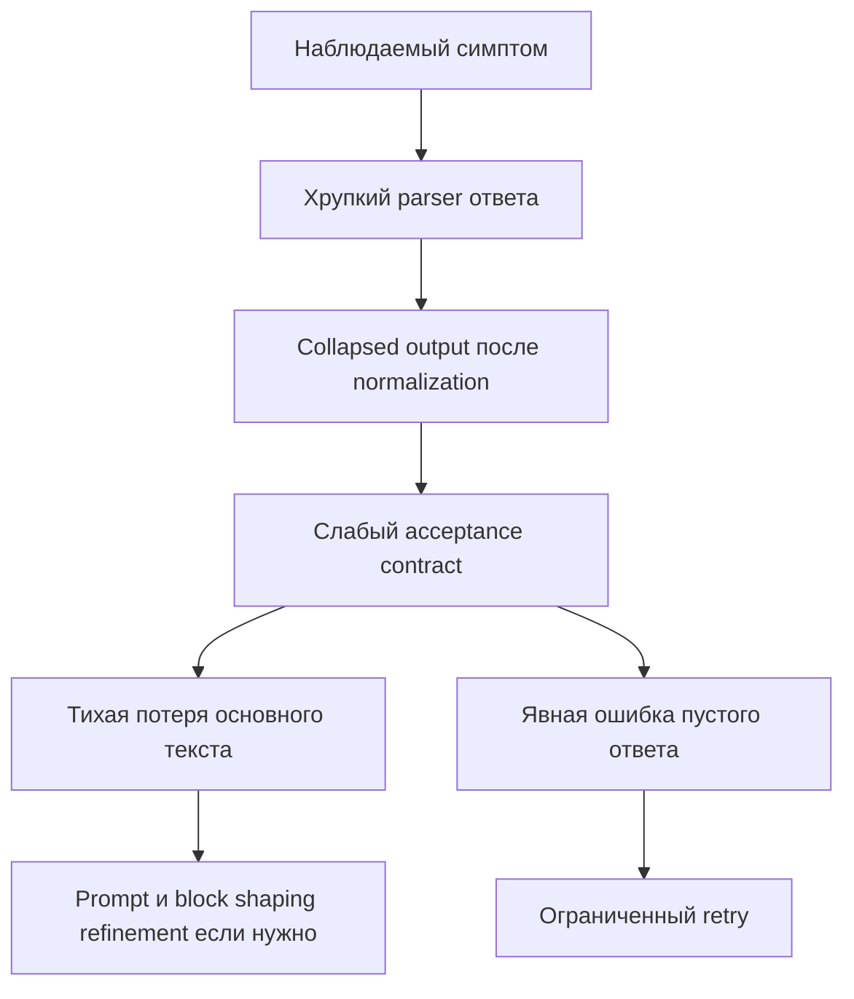

# Спецификация исправления регрессии text model I/O — DocxAICorrector

**Дата:** 2026-03-16  
**Обновлено:** 2026-03-17  
**Статус:** Must-fix этапы 0–2 реализованы; hardening этапы 3–4 остаются pending  
**Источник истины:** узкий regression-focused review text I/O slice, быстрые тесты и наблюдение пользователя на `tests/sources/Лиетар глава1.docx`  
**Связанный более широкий контекст:** при необходимости см. `plans/CODE_REVIEW_REMEDIATION_SPEC_2026-03-16.md`, но этот документ самодостаточен и посвящён только текущей регрессии text model I/O  
**Назначение документа:** зафиксировать безопасный, поэтапный и implementation-ready план исправления регрессии, не смешивая подтверждённые факты, вероятные причины и гипотезы, требующие живой проверки

---

## Цель спецификации

Цель этого документа — задать отдельный план исправления регрессии в text model I/O path, которая проявляется потерей основного текста в части блоков и ошибкой пустого ответа модели на реальном документе `tests/sources/Лиетар глава1.docx`.

Спецификация должна позволить следующему implementation-этапу:

- сначала закрыть наиболее вероятную и наиболее опасную несовместимость в parser-слое ответов модели;
- затем убрать ложный success-path, при котором `heading-only` output может пройти как успешный результат;
- затем добавить ограниченный retry для empty или collapsed output;
- только после этого, при необходимости, уточнять prompt и block-shaping;
- сохранить явное разделение между `must-fix` изменениями и последующим hardening.

Ключевой принцип: **сначала устранить хрупкость на границе model output, затем ужесточить acceptance-контракт, и только потом трогать поведенческие улучшения prompt и chunk shaping**.

> **Статус реализации (2026-03-17):** Этапы 0 (диагностика), 1 (parser compatibility fix) и 2 (acceptance hardening) **уже реализованы** в `generation.py` и `document_pipeline.py` с полным покрытием в `tests/test_generation.py` и `tests/test_document_pipeline.py`. Секция «Подтверждённые факты» ниже описывает состояние кода **до** этих фиксов и сохраняется как историческая мотивация. Текущее состояние кода описано в секции «Статус реализации по этапам».

---

## Контекст и наблюдаемые симптомы

Пользователь наблюдает проблему на документе `tests/sources/Лиетар глава1.docx`:

1. после обработки часть блоков содержит только заголовки;
2. основной текст в таких блоках исчезает без явного фейла всего пайплайна;
3. на одном из блоков возникает ошибка `Модель вернула пустой ответ`.

С учётом review и быстрых тестов это выглядит не как одна изолированная поломка, а как комбинация нескольких слабых контрактов в text model I/O chain:

1. ответ модели может быть извлечён не из того поля или не из всех допустимых payload-shape;
2. уже извлечённый ответ может нормализоваться до пустой строки;
3. даже слишком слабый результат может пройти как success, если он формально непустой;
4. дополнительное влияние могут оказывать форма входных блоков и строгость system prompt.

---

## Подтверждённые факты (историческая мотивация)

Ниже перечислено то, что было подтверждено review-контекстом и быстрыми тестами **до** реализации фиксов. Этот раздел сохранён как историческая мотивация для принятых решений. Текущее состояние кода см. в секции «Статус реализации по этапам».

### 1. Хрупкий parser model output

> **ИСПРАВЛЕНО (Этап 1).** Parser переписан и покрыт тестами. См. секцию «Статус реализации по этапам — Этап 1».

В `generation.py` до фикса было поведение:

- `generation._extract_response_output_text()` доверяла только `response.output_text`;
- если `response.output_text` отсутствовал, функция возвращала пустую строку;
- это было возможно даже тогда, когда полезный текст присутствовал в альтернативной payload-форме внутри `response.output`.

Следствие: часть ответов Responses API ошибочно интерпретировалась как пустой ответ не потому, что модель ничего не вернула, а потому что parser не умел прочитать фактический shape ответа.

### 2. Normalization может схлопнуть ответ в пустую строку

> **ИСПРАВЛЕНО (Этап 0).** `_extract_normalized_markdown()` теперь явно различает `empty_response` и `collapsed_output`.

В `generation.py` до фикса было поведение:

- `generation.normalize_model_output()` удаляет surrounding whitespace;
- fenced output и whitespace-only output после нормализации могут превратиться в пустую строку.

Следствие: даже если transport-level ответ не пустой, post-processing может свести его к состоянию, которое логика пайплайна трактует как пустой ответ.

### 3. Acceptance-контракт слишком слабый

> **ИСПРАВЛЕНО (Этап 2).** `_classify_processed_block()`, `_is_heading_only_markdown()`, `_input_has_body_text_signal()` реализованы. `heading_only_output` теперь вызывает pipeline failure.

В `document_pipeline.py` до фикса было поведение:

- `document_pipeline.run_document_processing()` считает успешным любой непустой `processed_chunk`;
- `heading-only` output может пройти как success, даже если в целевом блоке ожидался основной текст;
- это создаёт false success-path и тихую потерю контента.

### 4. Доказательная база зафиксирована тестами

> **АКТУАЛЬНО.** Тесты существуют и теперь подтверждают корректность фиксов, а не наличие проблемы.

Тесты уже существуют и подтверждают реализованные фиксы:

- `tests/test_generation.py` покрывает fallback extraction из `response.output` при отсутствии `response.output_text`, nested value wrappers, `unsupported_response_shape`, а также whitespace или fenced-empty normalization;
- `tests/test_document_pipeline.py` покрывает отклонение `heading-only` output для body-heavy input и принятие `heading-only` для легитимного heading-only input.

Эти тесты являются доказательной базой первой волны remediation.

---

## Наиболее вероятная регрессия и почему раньше работало

### Наиболее вероятная регрессия

Наиболее вероятная причина новых ошибок `Модель вернула пустой ответ` — несовместимость parser-логики с фактическим shape ответов Responses API в `generation.py`.

Почему именно это считается наиболее вероятным:

1. подтверждено кодом, что parser читает только `response.output_text`;
2. подтверждено тестом, что альтернативный payload может существовать при пустом или отсутствующем `response.output_text`;
3. пользовательский симптом включает именно пустой ответ модели, что напрямую совпадает с failure-mode parser-а.

### Почему это похоже на регрессию, а не на давно известный дефект

Наиболее правдоподобное объяснение фразы пользователя `раньше работало, а сейчас пошли пустые ответы` такое:

- ранее реальный runtime чаще возвращал shape, где `response.output_text` был заполнен, поэтому latent несовместимость не проявлялась;
- после недавних изменений вокруг text model I/O, Responses API, модели или richer semantic block shaping фактический shape ответа и чувствительность пайплайна изменились;
- слабый acceptance-контракт и отсутствие retry на collapsed output превратили latent проблему parser-а в заметную пользовательскую регрессию.

### Что здесь подтверждено, а что нет

Подтверждено:

- parser действительно хрупкий;
- normalization действительно может схлопнуть output;
- acceptance действительно допускает ложный success.

Не доказано как единственная root cause без live данных:

- что именно изменение provider shape или модели является единственным источником регрессии;
- что все случаи потери текста вызваны только parser-слоем;
- что block-shaping не усилил проблему на конкретном документе.

Поэтому в implementation-работе нужно считать parser incompatibility **наиболее вероятной первичной причиной**, но не объявлять её единственной доказанной root cause до живой диагностики.

---

## Альтернативные и сопутствующие факторы

Ниже перечислено только то, что уже обосновано кодом или review-контекстом, но не должно подменять primary must-fix.

### 1. Отсутствие retry на empty или collapsed output

В `generation.generate_markdown_block()` empty output приводит к ошибке, но специального ограниченного retry именно для случаев empty или normalization-collapsed output нет.

Почему это важно:

- даже после parser compatibility fix могут оставаться единичные ответы, где модель реально вернула пустой или схлопнутый результат;
- сейчас такие случаи сразу превращаются в block failure;
- ограниченный retry может снизить чувствительность к transient ответам без размывания основного контракта.

### 2. Недостаточная жёсткость system prompt

`prompts/system_prompt.txt` потенциально недостаточно жёстко запрещает:

- возвращать только заголовок без основного текста;
- возвращать пустой блок;
- сокращать содержимое, если исходный блок содержит развитый body text.

Это не подтверждено как root cause, но обосновано как contributing factor.

### 3. Возможная деградация формы входных блоков

Возможный contributing factor находится в shape входа до обращения к модели:

- `document.build_semantic_blocks()`;
- `document.build_editing_jobs()`;
- `models.ParagraphUnit.rendered_text`;
- косвенно этап подготовки в `preparation.py`.

Гипотеза: если входной блок стал слишком заголовочным, слишком коротким, плохо сбалансированным по контексту или разорвал связанность body text, модель легче возвращает `heading-only` output. Эта гипотеза правдоподобна, но пока не доказана как обязательная причина текущего регресса.

---

## Что требует живой проверки

Ниже перечислены пункты, которые нельзя считать доказанными только на основании статического review и быстрых тестов.

### 1. Реальный shape provider response на проблемном документе

Нужно подтвердить на живом запуске:

- присутствует ли полезный текст в `response.output` при пустом `response.output_text`;
- какие content-item type реально приходят от Responses API;
- есть ли различия между проблемными и успешными блоками.

### 2. Характер collapsed output после normalization

Нужно понять:

- приходит ли fenced-empty output от модели как единичная аномалия;
- либо parser извлекает не тот fragment и потому normalization даёт пустую строку;
- либо модель реально отвечает пустым блоком при определённой форме входа.

### 3. Форма input blocks на проблемных участках

Нужно сравнить для failing blocks:

- исходный `target_text`;
- `context_before` и `context_after`;
- наличие доминирующего заголовка относительно body text;
- размер блока и соотношение heading к body.

### 4. Масштаб проблемы `heading-only` output

Нужно проверить:

- возникает ли `heading-only` только на одном документе;
- зависит ли это от конкретной модели;
- коррелирует ли это с отдельными типами semantic blocks.

Результат этой диагностики должен влиять только на hardening и refinement-этапы. Он не должен блокировать первичные must-fix изменения parser-а и acceptance-контракта.

---

## Scope / Out of scope

### Scope

В рамках этой спецификации планируются изменения только вокруг text model I/O regression:

1. compatibility fix извлечения ответа модели в `generation.py`;
2. hardening acceptance-логики в `document_pipeline.py`;
3. limited retry для empty или collapsed output в `generation.py`;
4. при необходимости — refinement prompt и block-shaping в `prompts/system_prompt.txt`, `document.py`, `preparation.py`.

### Out of scope

Вне рамок этой спецификации:

- смена OpenAI provider или замена модели;
- общий рефакторинг всего document pipeline;
- redesign DOCX extraction, не связанный с текущей регрессией;
- произвольные эвристики качества текста, не основанные на подтверждённых симптомах;
- правки production-кода вне перечисленных областей без прямой связи с регрессией.

---

## Целевая стратегия исправления

Исправление должно идти в безопасном порядке, где каждый следующий этап усиливает контракт поверх уже стабилизированного предыдущего слоя.

### Обязательный порядок внедрения

1. **Сначала** compatibility fix для parser-а в `generation.py`.
2. **Затем** hardening acceptance-логики в `document_pipeline.py`.
3. **Затем** limited retry на empty или collapsed output.
4. **Затем**, только если проблема не закрыта полностью или диагностика показывает остаточные искажения, prompt и block-shaping refinement в `prompts/system_prompt.txt`, `document.py`, `preparation.py`.

### Почему порядок должен быть именно таким

- Нельзя корректно судить о качестве acceptance, пока parser может терять валидный текст ещё до acceptance.
- Нельзя настраивать retry до того, как определено, что именно считается валидным output и что именно является дефектом извлечения.
- Нельзя агрессивно трогать prompt или shape блоков, пока не стабилизирован транспортный и acceptance слой, иначе причины остаточной деградации смешаются.

---

## Must-fix сразу и что можно отложить

### Must-fix в первой волне

#### MF-1. Parser compatibility fix — РЕАЛИЗОВАНО

Закрывает наиболее вероятную причину ложного empty response. Реализован в `generation._extract_response_output_text()` с поддержкой fallback на `response.output[]`, whitelist `_SUPPORTED_RESPONSE_TEXT_TYPES`, nested value wrappers, explicit `unsupported_response_shape` ошибки. Покрыт тестами в `tests/test_generation.py`.

#### MF-2. Acceptance hardening для `heading-only` и явно collapsed output — РЕАЛИЗОВАНО

Убирает false success-path и тихую потерю текста. Реализован в `document_pipeline.py` через `_classify_processed_block()`, `_is_heading_only_markdown()`, `_input_has_body_text_signal()`. Покрыт тестами в `tests/test_document_pipeline.py`.

#### MF-3. Минимальная диагностика для различения parser failure, real empty output и acceptance rejection — РЕАЛИЗОВАНО

Обеспечивает наблюдаемость причин отказа. Реализовано через classification в `_extract_normalized_markdown()` (`empty_response` vs `collapsed_output`) и `_classify_processed_block()` (`empty` vs `heading_only_output` vs `valid`).

### Можно отложить во вторую волну hardening

#### H-1. Limited retry на empty или collapsed output — НЕ РЕАЛИЗОВАНО

Нужно, но может идти после MF-1 и MF-2, потому что retry не должен маскировать parser incompatibility. Текущий `is_retryable_error()` в `image_shared.py` проверяет только HTTP status codes (408, 409, 429, 5xx) и API-level error class names. `RuntimeError("collapsed_output")` и `RuntimeError("empty_response")` **не считаются retryable** и немедленно propagate как fatal error.

#### H-2. Prompt refinement — НЕ РЕАЛИЗОВАНО

Нужно только если после первичных фиксов останется заметная доля `heading-only` или агрессивно сокращённых ответов. Текущий system prompt в `prompts/system_prompt.txt` не содержит явного запрета на heading-only или пустой результат.

#### H-3. Block-shaping refinement — НЕ РЕАЛИЗОВАНО

Нужно только если live проверка покажет, что проблемные входные blocks действительно провоцируют потерю основного текста.

---

## Детальный план изменений по этапам

## Этап 0. Диагностика перед фиксом — РЕАЛИЗОВАНО

> **Статус:** реализовано. `_extract_normalized_markdown()` в `generation.py` различает `empty_response` и `collapsed_output`. `_classify_processed_block()` в `document_pipeline.py` классифицирует output как `valid`, `empty` или `heading_only_output`. Pipeline логирует `output_classification`, `input_preview`, `output_preview` при rejection.

### Какие файлы и функции затрагиваются

На этом этапе основная цель — определить, что именно нужно логировать и какими тестами закрепить наблюдаемость. Основные точки анализа:

- `generation._extract_response_output_text`;
- `generation.generate_markdown_block`;
- `document_pipeline.run_document_processing`;
- `document.build_semantic_blocks`;
- `document.build_editing_jobs`;
- `models.ParagraphUnit.rendered_text`.

### Какой дефект закрывается

Этот этап не чинит root cause напрямую, но закрывает дефицит наблюдаемости между тремя разными failure-mode:

- parser не извлёк текст;
- text был извлечён, но схлопнулся после normalization;
- пайплайн принял слишком слабый output как success.

### Почему этап идёт первым

Без минимальной диагностики последующие фиксы будет трудно отличить по эффекту, особенно на документе `tests/sources/Лиетар глава1.docx`.

### Какие проверки должны это подтвердить

- логирование источника извлечённого текста;
- логирование факта empty-after-normalization;
- логирование признака rejection из-за `heading-only` или severe text loss;
- сравнение проблемных и успешных блоков на живом документе.

### Риски

- **False positive:** чрезмерная диагностика может выглядеть как отдельный функциональный change, хотя это только observability.
- **False negative:** если логируется только финальный текст без указания источника, реальная причина снова будет неочевидна.
- **Rollback-риск:** низкий, если диагностика ограничена техническими полями и не меняет бизнес-решение сама по себе.

---

## Этап 1. Compatibility fix для parser-а ответа модели — РЕАЛИЗОВАНО

> **Статус:** реализовано. `_extract_response_output_text()` поддерживает fallback на `response.output[]` с whitelist `_SUPPORTED_RESPONSE_TEXT_TYPES = {"output_text", "text"}`, nested `.value` wrappers через `_coerce_response_text_value()`, helper `_extract_text_from_content_item()`, и explicit `unsupported_response_shape` ошибки. Покрыт тестами `test_extract_response_output_text_falls_back_to_supported_response_output_items`, `test_extract_response_output_text_reads_supported_nested_text_value_from_response_output`, `test_generate_markdown_block_raises_on_unsupported_response_shape_in_output_items` и др.

### Какие файлы и функции затрагиваются

- `generation.py`
- `generation._extract_response_output_text()`
- при необходимости небольшой supporting helper рядом в `generation.py` для обхода альтернативных payload-shape Responses API

### Какой дефект закрывается

Закрывается наиболее вероятный дефект ложного `empty response`, когда полезный текст реально присутствует в `response.output`, но не читается текущей логикой.

### Целевое изменение

Parser должен:

1. сначала использовать `response.output_text`, если это валидная непустая строка;
2. если `response.output_text` отсутствует или пуст, попытаться извлечь текст из поддерживаемых элементов внутри `response.output`;
3. различать случаи:
   - ответа нет вообще;
   - ответ есть, но в неподдерживаемом формате;
   - ответ извлечён, но после normalization пуст;
4. не молча возвращать `""` при наличии данных в альтернативной структуре.

### Почему этот этап идёт первым

Если parser по-прежнему теряет валидный текст, все дальнейшие улучшения acceptance или retry будут строиться поверх искажённого входа и не дадут достоверного результата.

### Какие тесты должны подтвердить исправление

Минимум:

- расширение `tests/test_generation.py` сценариями успешного чтения текста из альтернативной payload-формы `response.output`;
- проверка приоритета между `response.output_text` и fallback parser path;
- проверка понятной ошибки для реально неподдерживаемого ответа.

Желательно:

- отдельный тест на mixed payload, где `response.output_text` пуст, но `response.output` содержит usable text;
- отдельный тест на отсутствие usable text во всех известных полях.

### Риски

- **False positive:** parser может извлечь служебный или нецелевой текст из неподходящего content-item.
- **False negative:** parser всё ещё может пропустить реальный payload shape, если поддержка окажется слишком узкой.
- **Rollback-риск:** средний, потому что изменение касается транспортной границы с моделью. Для снижения риска нужно сначала расширить unit coverage и логировать источник извлечённого текста.

---

## Этап 2. Hardening acceptance-логики результата блока — РЕАЛИЗОВАНО

> **Статус:** реализовано. В `document_pipeline.py` добавлены `ProcessedBlockStatus` type alias, `_is_heading_only_markdown()`, `_input_has_body_text_signal()`, `_classify_processed_block()`. При `heading_only_output` pipeline возвращает `"failed"` с диагностическими сообщениями и логированием `input_preview`/`output_preview`. Покрыт тестами `test_run_document_processing_rejects_heading_only_output_for_body_heavy_input` и `test_run_document_processing_accepts_heading_only_output_for_legitimate_heading_only_input`.

### Какие файлы и функции затрагиваются

- `document_pipeline.py`
- `document_pipeline.run_document_processing()`
- при необходимости новый локальный helper в `document_pipeline.py` для валидации достаточности output блока

### Какой дефект закрывается

Закрывается тихая потеря основного текста, когда `heading-only` или иной явно деградированный output считается успешным только потому, что строка непуста.

### Целевое изменение

Acceptance-контракт должен перестать быть бинарным `непусто = success`.

Минимальное required поведение:

1. пустой или whitespace-only output остаётся фейлом;
2. output, который после normalization содержит только heading и не содержит признаков body text при body-heavy input, не должен считаться success;
3. пайплайн должен явно различать:
   - валидный output;
   - empty или collapsed output;
   - structurally insufficient output, например `heading-only` при ожидании body text.

### Почему этот этап идёт вторым

Только после стабилизации parser-а можно честно оценивать качество полученного output. Иначе acceptance начнёт отклонять результаты, искажённые самим parser-слоем.

### Какие тесты должны подтвердить исправление

Минимум:

- обновление `tests/test_document_pipeline.py`, чтобы `heading-only` output больше не считался success;
- тест на явный fail или degraded outcome для блока с развитым body text и заголовком без содержимого;
- тест на сохранение success для реального heading-only input, если сам target block действительно состоит только из заголовка.

Желательно:

- тест на резкое падение объёма output относительно input без body-сигналов;
- тест на сохранение легитимных коротких блоков, чтобы не переусилить контракт.

### Риски

- **False positive:** слишком жёсткий acceptance может отклонять корректные короткие блоки, подзаголовки или сильно сокращённые, но допустимые ответы.
- **False negative:** слишком мягкая эвристика по-прежнему пропустит часть случаев потери body text.
- **Rollback-риск:** средний, потому что success-path станет строже. Для снижения риска критерии нужно привязать к типу и насыщенности входного `target_text`, а не к голому числу символов.

---

## Этап 3. Limited retry на empty или collapsed output — НЕ РЕАЛИЗОВАНО

> **Статус:** не реализовано. `is_retryable_error()` в `image_shared.py` проверяет только HTTP 408/409/429/5xx и API class names. `RuntimeError("collapsed_output")` и `RuntimeError("empty_response")` не считаются retryable и немедленно propagate как fatal error. Для реализации нужно добавить отдельную retry-логику в `generate_markdown_block()` именно для этих категорий, не расширяя `is_retryable_error`.

### Какие файлы и функции затрагиваются

- `generation.py`
- `generation.generate_markdown_block()`
- при необходимости небольшая классификация ошибок empty или collapsed output рядом в `generation.py`

### Какой дефект закрывается

Закрывается contributing factor, при котором transient empty или normalization-collapsed output сразу приводит к block failure без ещё одной попытки.

### Целевое изменение

Retry должен быть ограниченным и адресным:

1. не маскировать parser incompatibility;
2. срабатывать только после Этапа 1, когда parser уже умеет читать известные shape;
3. применяться к empty output и collapsed-after-normalization output как к отдельной retryable категории;
4. оставаться ограниченным по числу попыток и хорошо диагностируемым.

### Почему этап идёт третьим

Если добавить retry раньше, он может скрыть реальные ошибки parser-а и усложнить диагностику. После Этапов 1 и 2 retry становится именно hardening-мерой, а не способом скрыть контрактные дефекты.

### Какие тесты должны подтвердить исправление

Минимум:

- `tests/test_generation.py` должен покрывать повторную попытку при empty-after-normalization;
- тест, где первая попытка пустая, а вторая валидная, должен завершаться success;
- тест, где все попытки empty, должен завершаться понятной ошибкой без бесконечного повтора.

### Риски

- **False positive:** retry может дать видимость исправления там, где корень в слабом prompt или плохом input block.
- **False negative:** ограниченный retry не спасёт реальные provider-level деградации, если проблема систематическая.
- **Rollback-риск:** низкий или средний, если retry адресный и не меняет семантику остальных ошибок.

---

## Этап 4. Prompt и block-shaping refinement, только если всё ещё нужно — НЕ РЕАЛИЗОВАНО

> **Статус:** не реализовано. System prompt (`prompts/system_prompt.txt`) не содержит явных запретов на heading-only или пустой результат. Решение о необходимости этого этапа требует live проверки после Этапов 1–3.

### Какие файлы и функции затрагиваются

Потенциально:

- `prompts/system_prompt.txt`
- `document.py`
- `document.build_semantic_blocks()`
- `document.build_editing_jobs()`
- `models.ParagraphUnit.rendered_text`
- `preparation.py`

### Какой дефект закрывается

Этот этап не предназначен для закрытия primary regression сам по себе. Он нужен только если после Этапов 1–3 остаются случаи:

- `heading-only` response на body-heavy input;
- агрессивное сокращение содержания моделью;
- плохая устойчивость на специфической форме semantic blocks.

### Целевое изменение

Возможные направления, если live данные подтвердят необходимость:

1. усилить system prompt требованием сохранять весь основной текст целевого блока и не возвращать только заголовок;
2. дополнить prompt явным запретом на пустой ответ и скрытую компрессию содержания;
3. улучшить shape блоков так, чтобы heading и связанный body text реже расходились по разным jobs;
4. проверить, не создаёт ли `ParagraphUnit.rendered_text` форму входа, которая повышает шанс `heading-only` output.

### Почему этап идёт последним

Потому что это уже поведенческий refinement. Если делать его раньше, можно скрыть настоящие контрактные дефекты transport и acceptance слоёв.

### Какие тесты должны подтвердить исправление

- при необходимости `tests/test_generation.py` для prompt-sensitive контрактов, если они выражаются через unit-layer;
- `tests/test_document.py` для block-shaping и rendering-инвариантов;
- `tests/test_preparation.py` для ожидаемой структуры jobs;
- целевой regression test или зафиксированный manual verification сценарий на документе `tests/sources/Лиетар глава1.docx`.

### Риски

- **False positive:** можно улучшить конкретный документ, но ухудшить другие типы контента слишком жёстким prompt.
- **False negative:** block-shaping refinement может не повлиять на проблему, если корень уже закрыт раньше.
- **Rollback-риск:** средний, потому что здесь начинается изменение поведения модели на более широком наборе документов.

---

## Изменения по файлам и функциям

| Файл | Функции и области | Назначение изменения | Приоритет | Статус |
|---|---|---|---|---|
| `generation.py` | `_extract_response_output_text` | Совместимое извлечение текста из нескольких поддерживаемых response-shape | Must-fix | РЕАЛИЗОВАНО |
| `generation.py` | `_extract_normalized_markdown` | Явное различение `empty_response` и `collapsed_output` | Must-fix supporting | РЕАЛИЗОВАНО |
| `generation.py` | `normalize_model_output` | Уточнение трактовки collapsed output и диагностируемости этого состояния | Must-fix supporting | РЕАЛИЗОВАНО |
| `generation.py` | `generate_markdown_block` | Limited retry для empty и collapsed cases | Hardening after must-fix | НЕ РЕАЛИЗОВАНО |
| `document_pipeline.py` | `run_document_processing`, `_classify_processed_block` | Отказ от acceptance по принципу `любой непустой output = success` | Must-fix | РЕАЛИЗОВАНО |
| `prompts/system_prompt.txt` | system prompt content | Усиление требования сохранять body text и не возвращать heading-only result | Hardening if needed | НЕ РЕАЛИЗОВАНО |
| `document.py` | `build_semantic_blocks` | Возможное сближение heading и body в проблемных shape | Hardening if needed | НЕ РЕАЛИЗОВАНО |
| `document.py` | `build_editing_jobs` | Возможная корректировка surrounding context для проблемных blocks | Hardening if needed | НЕ РЕАЛИЗОВАНО |
| `models.py` | `ParagraphUnit.rendered_text` | Проверка, не усиливает ли rendering heading-dominant input shape | Hardening if needed | НЕ РЕАЛИЗОВАНО |
| `preparation.py` | подготовка jobs | Поддержка refined block-shaping, если live диагностика покажет необходимость | Hardening if needed | НЕ РЕАЛИЗОВАНО |

---

## План диагностики до фикса

До внесения production-исправлений implementation-этап должен подготовить минимальный диагностический набор.

### Что нужно зафиксировать

1. Для каждого проблемного блока:
   - block index;
   - длину `target_text`;
   - длину `context_before` и `context_after`;
   - краткий preview input;
   - источник извлечённого output text;
   - длину raw extracted text до normalization;
   - длину после normalization.
2. Для каждого rejected output:
   - причина rejection;
   - classified status: `empty_response`, `collapsed_output`, `heading_only_output`, `unsupported_response_shape`.
3. Для случаев `heading-only`:
   - наличие body text во входном блоке;
   - наличие только heading во входном блоке;
   - приблизительное соотношение output length к input length.

### Как использовать эту диагностику

- подтвердить, что после Этапа 1 число `unsupported_response_shape` и ложных `empty_response` резко падает;
- подтвердить, что после Этапа 2 исчезает false success-path для `heading-only` output;
- определить, нужен ли вообще Этап 4.

### Что не следует делать

- не объявлять любую краткость output дефектом без сравнения с формой input;
- не смешивать parser failure с prompt-quality issue в одном статусе;
- не использовать диагностику как замену acceptance-контракту.

---

## План тестов и регрессий

Тест-план должен разделять must-fix проверку и последующий hardening.

### Первая волна тестов — обязательна — ПОКРЫТА

#### Для `generation.py`

В `tests/test_generation.py` покрыты следующие сценарии:

1. `test_extract_response_output_text_falls_back_to_supported_response_output_items` — fallback extraction из альтернативного `response.output`;
2. `test_extract_response_output_text_reads_supported_nested_text_value_from_response_output` — nested value wrappers;
3. `test_generate_markdown_block_raises_on_unsupported_response_shape_in_output_items` — unsupported response shape;
4. `test_generate_markdown_block_raises_on_missing_output_text` — empty response при отсутствии output_text;
5. `test_generate_markdown_block_raises_when_supported_response_output_collapses_after_normalization` — collapsed output после normalization;
6. `test_generate_markdown_block_raises_on_non_string_output_text` — non-string output_text;
7. `test_normalize_model_output_returns_empty_for_whitespace_only_fenced_block` — fenced-empty normalization;
8. `test_generate_markdown_block_raises_on_empty_model_output` — collapsed fenced block.

#### Для `document_pipeline.py`

В `tests/test_document_pipeline.py` покрыты следующие сценарии:

1. `test_run_document_processing_rejects_heading_only_output_for_body_heavy_input` — heading-only output для body-heavy input отклоняется;
2. `test_run_document_processing_accepts_heading_only_output_for_legitimate_heading_only_input` — legitimate heading-only input принимается;
3. `test_run_document_processing_fails_on_empty_processed_block` — empty processed block завершает обработку ошибкой;
4. Финальный status и error classification различимы для empty и structurally insufficient output.

### Вторая волна тестов — по результатам live проверки

#### Для retry

В `tests/test_generation.py`:

1. первая попытка collapsed, вторая валидная — итог success;
2. все попытки collapsed — итоговая ошибка предсказуема и стабильна.

#### Для prompt и block-shaping

При необходимости:

- `tests/test_document.py` для shape-инвариантов блоков;
- `tests/test_preparation.py` для структуры jobs;
- дополнительные targeted regression tests на характерные body-plus-heading blocks.

### Ручная регрессия на реальном документе

После unit-level фиксов обязательно нужна проверка на `tests/sources/Лиетар глава1.docx`.

Ожидаемое поведение ручной проверки:

- блоки больше не исчезают тихо;
- при наличии real provider issue причина диагностируется явно;
- доля `heading-only` output должна снизиться до нуля или стать явным rejection, а не скрытым success.

---

## Acceptance criteria

Исправление можно считать принятым только при выполнении всех критериев ниже.

### Контракт parser-а — ВЫПОЛНЕНО

1. ✅ `generation.py` больше не теряет текст только из-за отсутствия `response.output_text`, если текст присутствует в поддерживаемом альтернативном payload.
2. ✅ Неподдерживаемый response shape даёт явный диагностируемый failure, а не молчаливую пустую строку.

### Контракт normalization — ВЫПОЛНЕНО

3. ✅ Empty или collapsed output определяется явно и единообразно.
4. ✅ Логика не смешивает `не нашёл текст` и `нашёл текст, но он схлопнулся`.

### Контракт acceptance — ВЫПОЛНЕНО

5. ✅ `document_pipeline.py` больше не принимает `heading-only` output как success для блоков, где ожидается основной текст.
6. ✅ Легитимные heading-only input blocks не получают ложный rejection.

### Контракт retry — НЕ ВЫПОЛНЕНО

7. ❌ Limited retry срабатывает только на адресные empty или collapsed cases и не скрывает unsupported-response defects.

### Регрессионное поведение на документе — НЕ ПРОВЕРЕНО

8. ❓ На `tests/sources/Лиетар глава1.docx` не наблюдается тихая потеря body text в ранее проблемных блоках.
9. Если отдельный блок всё ещё не может быть обработан, пайплайн показывает диагностически корректную причину вместо ложного success.

---

## Rollout / verification checklist

Ниже приведён обязательный checklist для implementation и verification.

- [ ] Зафиксирован текущий live response shape хотя бы для одного проблемного блока
- [x] Реализован parser compatibility fix в `generation.py`
- [x] Расширены unit tests в `tests/test_generation.py`
- [x] Реализовано hardening acceptance в `document_pipeline.py`
- [x] Расширены unit tests в `tests/test_document_pipeline.py`
- [x] Добавлена диагностика различения `empty_response`, `collapsed_output`, `heading_only_output`, `unsupported_response_shape`
- [x] Проверено, что legitimate heading-only input не отклоняется ложно
- [ ] При необходимости добавлен limited retry для empty или collapsed output
- [ ] Повторно проверен документ `tests/sources/Лиетар глава1.docx`
- [ ] Решено на фактах, нужен ли prompt refinement
- [ ] Решено на фактах, нужен ли block-shaping refinement
- [ ] После всех этапов подтверждено отсутствие silent text loss на известном regression scenario

---

## Риски и меры снижения

### Риск 1. Parser начнёт извлекать не тот текст

**Суть риска:** fallback parser path может случайно собрать служебный или побочный content-item.

**Мера снижения:**

- whitelist известных supported content types;
- unit tests на разные response-shape;
- логирование источника extracted text.

### Риск 2. Acceptance станет слишком жёстким

**Суть риска:** legitimate short outputs или реальные subheading blocks будут ошибочно отклоняться.

**Мера снижения:**

- привязывать acceptance к форме input block;
- отдельно покрыть tests для legitimate heading-only blocks;
- избегать слишком грубого порога только по длине строки.

### Риск 3. Retry скроет настоящую проблему

**Суть риска:** limited retry может уменьшить видимость parser или prompt defects.

**Мера снижения:**

- вводить retry только после parser compatibility fix;
- логировать номер попытки и тип причины retry;
- не считать unsupported-response defects retryable по умолчанию.

### Риск 4. Prompt refinement ухудшит другие документы

**Суть риска:** слишком жёсткий prompt может сделать стиль ответов более тяжёлым, многословным или нестабильным на других документах.

**Мера снижения:**

- не трогать prompt до завершения первых этапов;
- менять prompt минимально и адресно;
- проверять не только проблемный документ, но и существующие базовые regression tests.

### Риск 5. Block-shaping refinement усложнит причину отклонений

**Суть риска:** изменение `build_semantic_blocks` или `build_editing_jobs` может внести новую вариативность и размыть связь между первичной регрессией и вторичными эффектами.

**Мера снижения:**

- считать этот этап строго отложенным hardening;
- выполнять его только при наличии live доказательств;
- изолировать тесты shape-инвариантов отдельно от parser и acceptance tests.

---

## Итоговая последовательность внедрения

1. ~~Подготовить минимальную диагностику и классификацию failure-mode.~~ **РЕАЛИЗОВАНО**
2. ~~Исправить parser compatibility в `generation.py`.~~ **РЕАЛИЗОВАНО**
3. ~~Закрыть false success-path в `document_pipeline.py`.~~ **РЕАЛИЗОВАНО**
4. Добавить limited retry на empty или collapsed output. **НЕ РЕАЛИЗОВАНО**
5. Повторно проверить `tests/sources/Лиетар глава1.docx`. **НЕ ВЫПОЛНЕНО**
6. Только при подтверждённой необходимости уточнить `prompts/system_prompt.txt`, `document.py`, `preparation.py`. **НЕ РЕАЛИЗОВАНО**

---

## Статус реализации по этапам (2026-03-17)

### Реализовано

| Этап | Что сделано | Где в коде |
|---|---|---|
| Этап 0 | Классификация failure-mode: `empty_response`, `collapsed_output`, `unsupported_response_shape`, `heading_only_output`, `empty_processed_block` | `generation._extract_normalized_markdown()`, `document_pipeline._classify_processed_block()` |
| Этап 1 | Parser fallback на `response.output[]`, whitelist `_SUPPORTED_RESPONSE_TEXT_TYPES`, nested value wrappers, explicit unsupported-shape errors | `generation._extract_response_output_text()`, `_extract_text_from_content_item()`, `_coerce_response_text_value()`, `_read_response_field()` |
| Этап 2 | Acceptance reject для `heading_only_output` при body-heavy input, legitimate heading-only pass-through | `document_pipeline._classify_processed_block()`, `_is_heading_only_markdown()`, `_input_has_body_text_signal()` |

### Не реализовано

| Этап | Что нужно | Блокировка |
|---|---|---|
| Этап 3 | Limited retry для `empty_response` / `collapsed_output` в `generate_markdown_block()` | Нет блокировки, можно делать. `is_retryable_error()` НЕ покрывает эти RuntimeError — нужна отдельная retry-логика |
| Этап 4 | Prompt refinement: запрет heading-only и пустых результатов в system prompt; block-shaping | Требует live проверки после Этапов 1–3 |
| Live verification | Проверка на `tests/sources/Лиетар глава1.docx` | Требует запуска приложения |

Итоговый ожидаемый результат этой remediation-волны: **пустые ответы из-за parser incompatibility перестают быть ложными, `heading-only` output перестаёт считаться нормальным success, а оставшиеся аномалии становятся явно диагностируемыми и пригодными для точечного hardening вместо тихой потери текста**.
