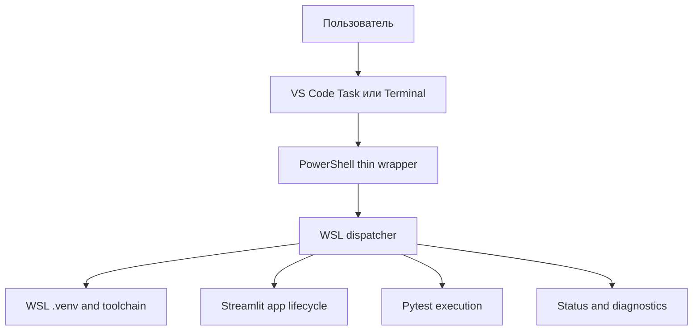

# Спецификация: атомарная переделка WSL-first dev workflow для DocxAICorrector

> Статус: cutover уже реализован. Разделы `Текущее состояние` и `План атомарного внедрения` ниже фиксируют baseline и план на момент проектирования; актуальные task names для текущего репозитория — `Project Status`, `Start Project`, `Stop Project`, `Run Full Pytest`, `Run Current Test File`, `Run Current Test Node`, `Tail Streamlit Log`.

## 1. Цель

Зафиксировать атомарную переделку локального dev workflow, которая:

- использует WSL как единственный runtime для Python, pytest, Streamlit и Pandoc
- использует Windows PowerShell только как thin wrapper и transport layer
- устраняет смешение Windows и WSL путей в test workflow
- переводит test workflow и VS Code task layer на единый dispatcher contract одним завершённым изменением
- не оставляет долгоживущих промежуточных operating modes, в которых часть test workflow работает через wrappers, а часть через raw command chains

## 2. Основание для изменения

Текущая проблема проявилась в тестовом прогоне, который упёрся в смешанный Windows/WSL путь.

По текущему устройству проекта видно, что базовая WSL-first модель уже существует:

- PowerShell проксирует вызовы в WSL через shared helper
- основной orchestration lifecycle уже вынесен в WSL shell script
- app lifecycle уже централизован вокруг текущего dispatcher contract
- env diagnostics уже централизованы через единый status pass
- документация уже публикует рабочие WSL команды для запуска тестов

Значит нужно не менять направление, а довести test workflow и task layer до того же уровня архитектурной завершённости.

При этом переделка должна быть выполнена как cutover, а не как длительное сосуществование старой и новой моделей.

## 3. Текущее состояние и границы переделки

### 3.1 Уже реализовано

- PowerShell shared layer с WSL bridge
- WSL dispatcher для app lifecycle и runtime status
- агрегированная env diagnostics в одном проходе `status`
- README и CONTRIBUTING с WSL-first требованиями и raw WSL командами для запуска тестов
- VS Code tasks для `Start Project`, `Stop Project`, `Project Status`, `Run Full Pytest PowerShell`, `Run Full Pytest WSL Visible`

### 3.2 Недостающие части

- нет test dispatcher contract уровня app lifecycle
- нет общего контракта для запуска полного pytest, файла и конкретного test node
- нет нормализации test target до единого repo-relative формата
- нет wrapper-driven task layer для запуска test file и test node
- документация и tasks всё ещё опираются на raw command chains как на рабочий operating model
- часть пользовательских сценариев всё ещё зависит от того, какой именно терминал открыт

### 3.3 Что считается предметом атомарной переделки

В рамках этой спецификации атомарно переделываются только слои test workflow:

- test dispatcher actions
- test target normalization
- PowerShell wrappers для тестов
- VS Code test tasks
- README и CONTRIBUTING для test workflow

Уже работающий app lifecycle не является предметом rename или архитектурного разворота.

Следовательно:

- существующие app actions сохраняются как есть
- test workflow доводится до того же уровня централизации одним пакетом изменений
- после merge не должно оставаться параллельного официального raw-command operating model для тестов

## 4. Принципы переделки без промежуточных состояний

### 4.1 Cutover вместо transition-mode

Переделка считается корректной только если новая модель вводится целиком в рамках одного завершённого набора изменений.

Недопустимый результат:

- dispatcher уже умеет test actions, но tasks ещё вызывают raw pytest
- wrappers уже существуют, но README и CONTRIBUTING по-прежнему рекомендуют raw command chains как основной путь
- часть тестовых сценариев идёт через repo-relative selector, а часть всё ещё принимает Windows absolute path

Допустимый результат:

- после merge все официальные entry points test workflow используют один и тот же dispatcher contract
- old raw-command examples либо удалены из основного потока документации, либо явно вынесены в раздел low-level diagnostics

### 4.2 No dual source of truth

После cutover не должно быть двух официальных способов запускать один и тот же тестовый сценарий.

Официальный путь должен быть один:

- terminal через wrapper или dispatcher contract
- VS Code tasks через те же wrappers

Raw WSL command может оставаться только как низкоуровневая diagnostic fallback-команда, а не как равноправный operating mode.

### 4.3 Backward compatibility only where it reduces risk

Сохранять нужно только те существующие контракты, которые уже обслуживают app lifecycle и не мешают финальной модели.

Следствие:

- `check-python`, `check-pandoc`, `check-api-key`, `status`, `run-streamlit`, `stop-streamlit`, `tail-log` сохраняются
- raw pytest tasks и raw pytest examples не считаются обязательной частью backward compatibility

## 5. Архитектурные принципы

### 5.1 Single runtime platform

Единственной средой исполнения считается WSL.

Следствия:

- `.venv` считается Linux virtualenv
- `pytest` запускается только внутри WSL
- `streamlit run` запускается только внутри WSL
- `pandoc` проверяется и используется только внутри WSL
- Windows virtualenv вида `.venv-win/` может существовать только для editor-side tooling и не должен участвовать в runtime auto-selection внутри PowerShell wrappers

### 5.2 Windows как transport layer

Windows не исполняет бизнес-логику запуска. Его роль:

- принять действие пользователя
- нормализовать входные параметры при необходимости
- передать управление в WSL helper
- вывести результат пользователю

Следствие: наличие `.venv-win/` или других Windows Python binaries не должно автоматически менять runtime-mode `Start Project`, `Stop Project`, `Project Status`, test wrappers или log wrappers.

### 5.3 Repo-relative contracts

Все команды, связанные с файлами тестов, должны работать через repo-relative selector.

Допустимый канонический формат:

```text
tests/test_image_integration.py
tests/test_image_integration.py::test_name
```

Запрещённые для WSL runtime формы:

```text
D:\www\projects\2025\DocxAICorrector\tests\test_image_integration.py
tests\test_image_integration.py
```

### 5.4 One source of truth for command logic

Вся логика запуска, диагностики и тестирования должна жить в одном WSL dispatcher.

PowerShell wrappers и VS Code tasks не должны дублировать командные цепочки.

## 6. Целевая архитектура

## 6.1 Основные слои



## 6.2 Ответственность слоёв

### Windows PowerShell layer

Отвечает только за:

- bridge в WSL
- path normalization до repo-relative формата для test target
- безопасную передачу аргументов
- user-facing messages

### WSL dispatcher layer

Отвечает за:

- проверку среды
- app lifecycle actions
- запуск тестов
- запуск тестового файла
- запуск конкретного test node
- вывод логов
- единообразные exit codes

### Runtime layer

Отвечает за фактическое исполнение:

- `.venv/bin/python`
- `pytest`
- `streamlit`
- `pandoc`
- `.env`

## 7. Dispatcher contract после cutover

### 7.1 Базовый сохраняемый contract

На текущий момент dispatcher уже реализует следующие действия:

- `check-python`
- `check-pandoc`
- `check-api-key`
- `status`
- `run-streamlit`
- `stop-streamlit`
- `tail-log`

Эти действия сохраняются без rename и образуют базовый contract для app lifecycle и diagnostics.

### 7.2 Что добавляется в рамках переделки

В рамках атомарной переделки dispatcher должен дополниться следующими test actions:

- `run-tests`
- `run-test-file`
- `run-test-node`

После merge именно этот расширенный набор считается единственным официальным dispatcher contract для dev workflow.

### 7.3 Что уже централизовано

Текущий contract уже покрывает:

- runtime status
- environment diagnostics
- запуск приложения
- остановку приложения
- просмотр логов

### 7.4 `run-tests`

Назначение:

- полный прогон `pytest tests`

Аргументы:

- pytest flags как passthrough при необходимости

### 7.5 `run-test-file`

Назначение:

- запуск одного test file

Аргументы:

- repo-relative path
- pytest flags как passthrough при необходимости

Пример канонического аргумента:

```text
tests/test_image_integration.py
```

### 7.6 `run-test-node`

Назначение:

- запуск одного pytest node id

Аргументы:

- repo-relative node id
- pytest flags как passthrough при необходимости

Пример канонического аргумента:

```text
tests/test_image_integration.py::test_name
```

## 8. Нормализация путей

## 8.1 Проблема

VS Code и PowerShell часто дают один из следующих вариантов:

- Windows absolute path
- workspace-relative path с обратными слешами
- уже корректный POSIX-relative path

Если передавать их напрямую в WSL runtime, возникает смешение семантики путей.

## 8.2 Текущее ограничение shared helper

Текущая функция Windows to WSL path conversion полезна для существующих app lifecycle сценариев, но не подходит как контракт для test target parsing.

Причины:

- она требует существующий путь на файловой системе
- она резолвит путь через filesystem lookup
- она не умеет обрабатывать pytest node id
- она не умеет принимать repo-relative selector как отдельную сущность

Следствие:

- normalizer для test workflow должен проектироваться как отдельный контракт, а не как небольшое расширение существующей функции path conversion

## 8.3 Целевой контракт normalizer

В PowerShell layer должна появиться функция нормализации test target.

Она принимает:

- absolute Windows path
- relative Windows path
- relative POSIX path

Она возвращает только:

```text
tests/test_image_integration.py
tests/test_image_integration.py::test_name
```

При этом normalizer отвечает только за shape-validation и canonicalization selector-а на стороне PowerShell layer.

Проверка реального существования файла в репозитории выполняется не в normalizer, а в WSL dispatcher.

Причина:

- файловое существование должно проверяться в том же runtime, где реально исполняется `pytest`
- это исключает расхождение между Windows filesystem semantics и WSL runtime semantics

## 8.4 Правила нормализации

1. Если вход содержит абсолютный путь внутри repo root, удалить repo prefix
2. Если вход содержит обратные слеши, заменить их на прямые
3. Если вход содержит pytest node suffix через `::`, нормализовать только файловую часть
4. Если путь выходит за границы repo root, завершать ошибкой
5. Если итог не начинается с `tests/` для тестовых action, завершать ошибкой
6. Если selector синтаксически корректен, но файл не существует, ошибку существования файла должен выдавать WSL dispatcher

## 9. Стандарт точных команд

## 9.1 Для WSL терминала

Полный прогон:

```bash
cd /mnt/d/www/projects/2025/DocxAICorrector && . .venv/bin/activate && pytest tests -q
```

Запуск файла:

```bash
cd /mnt/d/www/projects/2025/DocxAICorrector && . .venv/bin/activate && pytest tests/test_image_integration.py -vv
```

Запуск test node:

```bash
cd /mnt/d/www/projects/2025/DocxAICorrector && . .venv/bin/activate && pytest tests/test_image_integration.py::test_name -vv
```

## 9.2 Для PowerShell терминала

Полный прогон:

```powershell
wsl.exe -d Debian bash -lc "cd /mnt/d/www/projects/2025/DocxAICorrector && . .venv/bin/activate && pytest tests -q"
```

Запуск файла:

```powershell
wsl.exe -d Debian bash -lc "cd /mnt/d/www/projects/2025/DocxAICorrector && . .venv/bin/activate && pytest tests/test_image_integration.py -vv"
```

Запуск test node:

```powershell
wsl.exe -d Debian bash -lc "cd /mnt/d/www/projects/2025/DocxAICorrector && . .venv/bin/activate && pytest tests/test_image_integration.py::test_name -vv"
```

## 10. VS Code tasks после cutover

После cutover tasks должны быть только orchestration layer поверх dispatcher и wrappers.

Официальный набор tasks после merge на том этапе планирования:

- `Project Status`
- `Start Project`
- `Stop Project`
- `Run Full Pytest`
- `Run Current Test File`
- `Run Current Test Node`
- `Tail Streamlit Log`

Требования к task layer:

- test tasks не собирают raw pytest command самостоятельно
- test tasks не передают Windows absolute path напрямую в WSL
- file-level и node-level tasks используют один и тот же normalizer contract
- `Run Full Pytest PowerShell` и `Run Full Pytest WSL Visible` удаляются или переименовываются в финальные wrapper-driven tasks в том же change set

## 11. План атомарного внедрения

### 11.1 Принцип исполнения плана

План выполняется последовательно, но merge допускается только после завершения всех шагов.

Это означает:

- разработка может идти по локальным коммитам и промежуточным состояниям в рабочей ветке
- в основной branch изменение должно попасть как один завершённый cutover
- каждый следующий шаг опирается на контракты предыдущего и не должен переопределять их повторно

### 11.2 Шаг 0. Зафиксировать baseline и инварианты

Цель шага:

- не менять работающий app lifecycle
- зафиксировать, какие существующие entry points считаются неприкосновенным baseline

Файлы:

- `scripts/project-control-wsl.sh`
- `scripts/_shared.ps1`
- `.vscode/tasks.json`
- `README.md`
- `CONTRIBUTING.md`

Что нужно проверить до начала переделки:

- `status`, `run-streamlit`, `stop-streamlit`, `tail-log` работают как сейчас
- полный pytest проходит в каноническом WSL runtime
- текущие PowerShell wrappers для app lifecycle не требуют rename

Инварианты шага:

- существующие app actions не переименовываются
- существующие сценарии `Start Project`, `Stop Project`, `Project Status` не ломаются
- test workflow redesign не вносит побочный рефакторинг в app lifecycle

Артефакт завершения:

- список сохраняемых actions и границ изменений явно подтверждён кодом и документацией

### 11.3 Шаг 1. Спроектировать финальный test contract

Цель шага:

- определить финальный интерфейс test workflow до начала правок в tasks и документации

Файлы:

- `scripts/project-control-wsl.sh`
- `scripts/_shared.ps1`
- `plans/WSL_FIRST_DEV_WORKFLOW_SPEC.md`

Нужно зафиксировать:

- названия actions: `run-tests`, `run-test-file`, `run-test-node`
- формат входных аргументов
- допустимый passthrough для pytest flags
- ожидаемые exit codes для success, validation error и runtime error

Рекомендуемый контракт:

- `run-tests [pytest flags...]`
- `run-test-file <repo-relative-path> [pytest flags...]`
- `run-test-node <repo-relative-node-id> [pytest flags...]`

Требования к ошибкам:

- invalid test target должен завершаться предсказуемой validation error
- dispatcher должен печатать понятное сообщение, пригодное для PowerShell wrapper и VS Code task output
- WSL runtime error не должен маскироваться под path validation error

Артефакт завершения:

- финальный contract определён до написания wrappers и tasks

### 11.4 Шаг 2. Реализовать test actions в WSL dispatcher

Цель шага:

- сделать `scripts/project-control-wsl.sh` единственным исполнителем pytest-сценариев

Файл:

- `scripts/project-control-wsl.sh`

Что добавить:

- функцию запуска полного pytest
- функцию запуска test file
- функцию запуска test node
- валидацию обязательных аргументов на уровне dispatcher
- единообразный вызов `. .venv/bin/activate && pytest ...` внутри WSL contract

Что не делать:

- не дублировать pytest command в PowerShell wrappers
- не принимать Windows absolute path в dispatcher
- не добавлять в dispatcher логику угадывания Windows path semantics

Технические требования:

- dispatcher работает только с repo-relative test selector
- проверка `.venv` reuse-ит уже существующий runtime contract
- file-level и node-level ветки не расходятся по способу запуска pytest, кроме самого target

Промежуточная проверка:

- ручной вызов `run-tests`
- ручной вызов `run-test-file tests/test_config.py`
- ручной вызов `run-test-node tests/test_config.py::test_name`

Артефакт завершения:

- любой test execution сценарий уже доступен напрямую через WSL dispatcher

### 11.5 Шаг 3. Реализовать normalizer для test target в PowerShell layer

Цель шага:

- вынести Windows-specific parsing в transport layer и не пускать его в WSL runtime

Файл:

- `scripts/_shared.ps1`

Что добавить:

- отдельную функцию normalizer для test target
- отдельную функцию, при необходимости, для split file-part и pytest node suffix
- проверки принадлежности target к repo root

Что должен уметь normalizer:

- `D:\...\tests\test_x.py` -> `tests/test_x.py`
- `tests\test_x.py` -> `tests/test_x.py`
- `tests/test_x.py` -> `tests/test_x.py`
- `D:\...\tests\test_x.py::test_case` -> `tests/test_x.py::test_case`
- `tests\test_x.py::TestClass::test_case` -> `tests/test_x.py::TestClass::test_case`

Что должен отклонять normalizer:

- путь вне repo root
- путь не из `tests/`
- пустой target
- selector, в котором файловая часть после нормализации невалидна

Что принципиально не использовать как основу:

- `Convert-ToWslPath()` для парсинга pytest node id
- filesystem-only lookup как единственный способ понять relative selector

Промежуточная проверка:

- прогон на наборе representative input strings
- проверка одинакового результата для absolute Windows path, relative Windows path и POSIX-relative path

Артефакт завершения:

- PowerShell layer умеет выдавать только canonical repo-relative selector

### 11.6 Шаг 4. Добавить thin wrappers для тестов

Historical note: this wrapper-driven test layer was later superseded as the supported contract by `plans/TEST_WORKFLOW_CONTRACT_CLEANUP_SPEC_2026-03-14.md`. The repository now treats `scripts/test.sh` plus direct WSL VS Code tasks as the canonical test path.

Цель шага:

- сделать стабильные PowerShell entry points для full, file-level и node-level pytest

Файлы:

- `scripts/run-tests.ps1`
- `scripts/run-test-file.ps1`
- `scripts/run-test-node.ps1`
- при необходимости `scripts/_shared.ps1`

Требования к wrappers:

- wrapper не собирает raw pytest command
- wrapper делает только input validation, normalization и `Invoke-WslInProject`
- wrapper печатает понятные user-facing сообщения
- wrapper возвращает exit code дочернего WSL action без искажения semantics

Ожидаемое поведение:

- `run-tests.ps1` не принимает файловый target
- `run-test-file.ps1` требует один test file target
- `run-test-node.ps1` требует node id

Промежуточная проверка:

- запуск каждого wrapper вручную из PowerShell
- проверка validation error на заведомо плохих входах

Артефакт завершения на момент этого historical шага:

- Windows-side test entry points были стабилизированы и не дублировали command logic

### 11.7 Шаг 5. Перевести VS Code tasks на wrappers

Historical note: this step was also superseded. Current tasks invoke WSL/bash directly and no longer route test execution through PowerShell wrappers.

Цель шага:

- сделать tasks чистым orchestration layer без raw pytest chains

Файл:

- `.vscode/tasks.json`

Что изменить:

- заменить `Run Full Pytest PowerShell` и `Run Full Pytest WSL Visible`
- добавить `Run Full Pytest WSL`
- добавить `Run Current Test File WSL`
- добавить `Run Current Test Node WSL`
- добавить `Tail Streamlit Log`

Требования к task design:

- tasks вызывают только PowerShell wrappers
- task для current file передаёт selector в wrapper, а не строит WSL path вручную
- task для current node использует тот же selector contract
- task labels соответствуют финальному operating model и не содержат legacy naming

Практическое замечание:

- если VS Code variable substitution для current test node неудобна или нестабильна, это нужно решить на уровне wrapper contract или отдельного task input, а не откатом к raw pytest command

Промежуточная проверка:

- запуск full task
- запуск current file task
- запуск current node task
- проверка, что output отражает wrapper-driven flow, а не raw bash chain

Артефакт завершения:

- task layer больше не содержит pytest command knowledge

### 11.8 Шаг 6. Синхронизировать документацию с финальной моделью

Цель шага:

- убрать расхождение между кодом и официальным способом работы

Файлы:

- `README.md`
- `CONTRIBUTING.md`
- при необходимости `docs/AI_AGENT_DEVELOPMENT_RULES.md`

Что изменить:

- wrapper-driven flow публикуется как основной путь
- raw commands перестают быть primary path
- raw commands, если сохраняются, маркируются как low-level diagnostics или manual fallback
- названия tasks и scripts совпадают с реальной реализацией

Что особенно важно:

- не оставлять в README одновременно два равноценных способа запуска одного и того же test scenario
- не рекламировать старые task names после их удаления

Промежуточная проверка:

- документация позволяет пройти сценарий запуска тестов без знания внутренней реализации
- во всех документах для одного и того же сценария указано одно и то же имя task или wrapper

Артефакт завершения:

- документация больше не поддерживает legacy raw-command model как основной

### 11.9 Шаг 7. Закрыть тесты и acceptance matrix

Цель шага:

- доказать, что cutover завершён не только по коду, но и по поведению

Проверки уровня acceptance:

- WSL terminal: `run-tests`
- WSL terminal: `run-test-file tests/test_config.py`
- WSL terminal: `run-test-node tests/test_config.py::...`
- PowerShell wrapper: full run
- PowerShell wrapper: file-level run
- PowerShell wrapper: node-level run
- VS Code task: full run
- VS Code task: current file run
- VS Code task: current node run
- invalid path outside repo
- Windows-style relative path with backslashes
- Windows absolute path under repo root

Что нужно дополнительно проверить:

- app lifecycle tasks по-прежнему работают
- `Project Status` не изменил semantics
- `Start Project` и `Stop Project` не пострадали от новых helper changes

Артефакт завершения:

- есть подтверждение, что новая модель покрывает весь intended operating surface

### 11.10 Cutover criteria для merge

Изменение не должно вливаться частями.

PR считается готовым только если одновременно выполнены все условия:

- dispatcher умеет full, file-level и node-level test execution
- normalizer выдаёт единый canonical selector
- wrappers существуют для тех же сценариев
- tasks переведены на wrappers
- README и CONTRIBUTING синхронизированы с новой моделью
- официальный operating model для тестов больше не опирается на raw command chains
- app lifecycle contract не сломан и не переименован

## 12. Критерии готовности

Архитектура считается принятой, когда:

- любой тестовый сценарий запускается одинаково из WSL terminal, PowerShell wrapper и VS Code task
- в WSL dispatcher не попадает Windows absolute path
- команда запуска текущего тестового файла не зависит от типа терминала
- lifecycle приложения и тестов обслуживается одним dispatcher contract без incompatible rename текущих app actions
- README, CONTRIBUTING, wrappers и tasks описывают один и тот же способ работы
- raw command chains не являются официальным primary path для test workflow

## 13. Риски и ограничения

### Риск 1

Нормализуется только абсолютный путь, но не нормализуется relative path с обратными слешами.

Следствие:

- часть task сценариев продолжит ломаться

### Риск 2

VS Code tasks продолжат вызывать raw pytest, обходя wrappers.

Следствие:

- логика снова разойдётся между task layer и script layer

### Риск 3

Часть orchestration останется в PowerShell, а часть в WSL helper.

Следствие:

- появится дублирование и расхождение поведения

### Риск 4

Переделка будет выполнена частично: код уже переведён, а документация и tasks ещё нет.

Следствие:

- проект застрянет в затяжном dual-mode, где новый contract существует, но не является реальным source of truth

## 14. Итоговая рекомендация

Нужно закрепить single-platform workflow одним завершённым cutover:

- WSL как единственный runtime
- PowerShell как thin wrapper
- VS Code tasks как thin orchestration layer
- один WSL dispatcher как единственный source of truth для запуска, тестов и диагностики
- один официальный wrapper-driven operating model для тестов

Это минимальный по архитектурному долгу путь, который устраняет смешение Windows и WSL путей без большого рефакторинга приложения и без долгой жизни промежуточных состояний.
