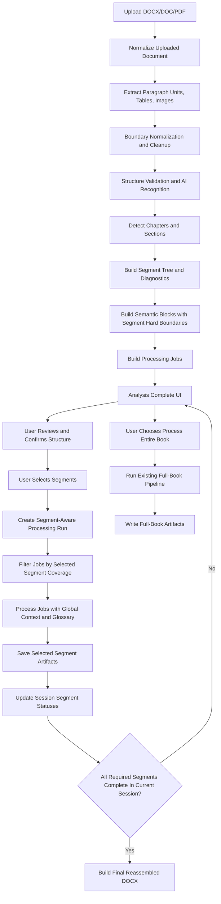

# Chapter-Based Document Processing Workflow Spec

Date: 2026-05-06

## Objective

Transition DocxAICorrector from a monolithic full-document translation workflow to a granular chapter and section based workflow.

After the initial document analysis, the system must present the user with processing statistics and a structured list of detected book chapters or sections. The user must be able to select a single chapter, multiple chapters, or the entire book for later translation and processing.

This removes the need for manual pre-splitting of files and enables incremental translation for phased voice-over production, episodic publication, review cycles, and partial reprocessing.

## Architectural Direction

DocxAICorrector already has the required lower-level execution model:

- Upload normalization in `src/docxaicorrector/processing/processing_runtime.py`.
- Preparation and analysis in `src/docxaicorrector/processing/preparation.py`.
- Paragraph units and structure metadata in `src/docxaicorrector/core/models.py`.
- Structure recognition in `src/docxaicorrector/structure/recognition.py`.
- Semantic block generation in `src/docxaicorrector/document/semantic_blocks.py`.
- Per-block processing in `src/docxaicorrector/pipeline/block_execution.py`.
- Final artifact generation in `src/docxaicorrector/pipeline/late_phases.py` and `src/docxaicorrector/runtime/artifacts.py`.
- Streamlit UI composition in `src/docxaicorrector/ui/_app.py` and `src/docxaicorrector/ui/_ui.py`.

The recommended implementation is to add a first-class `DocumentSegment` layer above the existing semantic block and job layer.

```text
Document
  -> ParagraphUnit[]
  -> DocumentSegment[]      user-facing chapters and sections
  -> DocumentBlock[]        LLM-safe execution chunks
  -> ProcessingJob[]        existing backend job payloads
```

Segments should be the UX and orchestration unit. Semantic blocks should remain the LLM execution unit.

## Parsing And Segment Detection

Add a new module:

```text
src/docxaicorrector/document/segments.py
```

### Proposed Models

```python
@dataclass(frozen=True)
class SegmentBoundaryEvidence:
    source: str  # heading_style, toc_match, page_break, numbering_pattern, ai_structure, fallback
    confidence: str  # high, medium, low
    details: dict[str, object]


@dataclass(frozen=True)
class DocumentSegment:
    segment_id: str
    parent_segment_id: str | None
    ordinal: int
    level: int
    title: str
    normalized_title: str
    start_paragraph_index: int
    end_paragraph_index: int
    start_paragraph_id: str
    end_paragraph_id: str
    paragraph_ids: tuple[str, ...]
    paragraph_count: int
    char_count: int
    word_count: int
    estimated_token_count: int  # Phase 1 heuristic: max(1, char_count // 4)
    structural_role: str  # front_matter, chapter, section, appendix, bibliography, toc, body_range
    confidence: str
    boundary_fingerprint: str
    boundary_evidence: tuple[SegmentBoundaryEvidence, ...]
    warnings: tuple[str, ...] = ()
```

```python
@dataclass(frozen=True)
class SegmentDetectionReport:
    segment_count: int
    high_confidence_count: int
    medium_confidence_count: int
    low_confidence_count: int
    fallback_segment_count: int
    toc_entry_count: int
    toc_matched_count: int
    warnings: tuple[str, ...]
```

```python
@dataclass(frozen=True)
class GlossaryTerm:
    source_term: str
    target_term: str = ""
    confidence: str = "medium"
    source_segment_id: str | None = None


@dataclass(frozen=True)
class SegmentOutlineEntry:
    segment_id: str
    title: str
    level: int
    structural_role: str
```

Phase 1 token estimation can use a deterministic low-cost heuristic:

```text
estimated_token_count = max(1, char_count // 4)
```

### Detection Signals

Run segment detection after extraction, cleanup, relation normalization, structure validation, and optional AI structure recognition.

Detection should combine these signals:

| Priority | Signal | Confidence | Behavior |
|---|---|---|---|
| 1 | Explicit DOCX heading styles | High | Treat `ParagraphUnit.role == "heading"` and `heading_level` as segment boundary |
| 2 | Structure recognition | High or medium | Use AI-promoted headings and `structural_role` metadata |
| 3 | Table of contents | High or medium | Match TOC entries to body headings and infer hierarchy |
| 4 | Numbering patterns | Medium | Detect `Chapter 1`, `Глава 1`, `Part I`, `Section 2.3`, roman numerals |
| 5 | Page or section breaks | Low or medium | Use only as supporting evidence unless paired with heading-like text |
| 6 | Typography | Low or medium | Centered, bold, all-caps, large-font short paragraphs |
| 7 | Fallback segmentation | Low | Split by size and natural paragraph boundaries when no reliable structure exists |

Fallback segmentation must use an explicit size contract rather than an abstract "split by size" rule.

Recommended Phase 1 rule:

```text
fallback_segment_max_chars = max(chunk_size * 4, 24000)
```

Fallback splitting should prefer the nearest safe boundary after a paragraph that is not inside a table/image atomic unit and is not a TOC cluster continuation.

### Detection Algorithm

```text
1. Build paragraph descriptors from prepared ParagraphUnit objects.
2. Identify TOC regions using existing structural roles such as toc_header and toc_entry.
3. Extract TOC candidates with title, optional page number, and hierarchy hints.
4. Identify boundary candidates from headings, numbering, typography, and page/section breaks.
5. Match TOC entries to candidate headings by reusing the existing TOC title normalization and fuzzy-prefix logic from `src/docxaicorrector/document/structure_repair.py`, especially `_collect_toc_title_variants()` and related matching helpers, instead of inventing a second independent matcher.
6. Assign segment levels from heading_level, numbering depth, TOC indentation, or inferred hierarchy.
7. Build a segment tree with parent and child links.
8. Mark front matter, TOC, body chapters, appendices, bibliography, and synthetic fallback ranges.
9. Clamp segment ranges to paragraph boundaries.
10. Validate that every paragraph belongs to exactly one leaf segment.
11. Split overlarge segments into synthetic child segments only when required by processing limits.
12. Return segment tree plus diagnostics for the analysis screen.
```

### Hard Boundaries For Semantic Blocks

`build_semantic_blocks()` should accept optional hard paragraph boundaries so LLM jobs do not cross chapter boundaries.

```python
def build_semantic_blocks(
    paragraphs: list[ParagraphUnit],
    max_chars: int = 6000,
    *,
    relations: list[ParagraphRelation] | None = None,
    hard_boundary_paragraph_ids: set[str] | None = None,
) -> list[DocumentBlock]:
    ...
```

This is important because later partial processing must be able to select chapter-owned jobs without accidental bleed into another chapter.

## Prepared Data Contract

Extend `PreparedDocumentData` in `src/docxaicorrector/processing/preparation.py`:

```python
@dataclass
class PreparedDocumentData:
    source_text: str
    paragraphs: list
    image_assets: list
    relations: list[ParagraphRelation]
    jobs: list[dict[str, Any]]
    segments: list[DocumentSegment]
    segment_diagnostics: SegmentDetectionReport
    structure_fingerprint: str
    detector_version: str
    prepared_source_key: str
    ...
```

Preparation should produce:

- `paragraphs`
- `relations`
- `structure_map`
- `segments`
- `segment_diagnostics`
- `structure_fingerprint`
- `detector_version`
- `semantic_blocks`
- `jobs`
- `segment_to_job` mapping
- high-level analysis statistics

### PreparedRunContext Extension

The UI layer does not consume `PreparedDocumentData` directly. It consumes `PreparedRunContext` from `src/docxaicorrector/ui/application_flow.py`, which is created by mapping fields from `PreparedDocumentData` inside `_build_prepared_run_context(...)` and then transported through `PreparationCompleteEvent`.

Therefore the same segment-related fields must also be added to `PreparedRunContext`:

```python
@dataclass
class PreparedRunContext:
    ...
    segments: list[DocumentSegment]
    segment_diagnostics: SegmentDetectionReport
    structure_fingerprint: str
    detector_version: str
```

Required implementation rule:

```text
PreparedDocumentData -> PreparedRunContext mapping must copy all segment-related fields.
The analysis screen and chapter selector must read from PreparedRunContext, not from PreparedDocumentData.
```

## State Model

Do not introduce a database-backed persistent state model for the first implementation.

The intended user model is session scoped: each fresh upload starts a new analysis and clears prior processing statuses. The user is expected to know which chapter was translated in a previous session and select the next chapter manually.

The core requirement is therefore not durable processing state. The core requirement is **verifiable and reproducible structure detection**.

### Session State

Keep runtime state in Streamlit/session memory and existing run artifacts:

- detected segments for the current uploaded document;
- selected segment IDs;
- active processing status for selected segments;
- completed outputs for the current session;
- structure confirmation state;
- exported structure manifest path when generated.

Recommended in-session statuses:

```text
pending
selected
queued
processing
completed
failed
skipped
```

Avoid `stale` in the first implementation because cross-session staleness is not tracked.

### Structure Manifest

After analysis, allow the user to export the detected structure as a lightweight JSON manifest. This is not a processing database. It is a reproducibility and audit artifact.

Suggested path pattern:

```text
.run/structure_manifests/<timestamp>_<source_stem>.segments.json
```

Manifest fields:

```json
{
  "schema_version": 1,
  "source_name": "book.docx",
  "source_content_hash16": "0123abcd4567ef89",
  "prepared_source_key": "...",
  "detector_version": "chapter_segments_v1",
  "detector_config": {
    "chunk_size": 12000,
    "structure_recognition_mode": "...",
    "min_confidence": "medium"
  },
  "structure_fingerprint": "...",
  "summary": {
    "paragraph_count": 312,
    "segment_count": 22,
    "toc_entry_count": 18,
    "toc_matched_count": 17,
    "low_confidence_count": 1
  },
  "segments": [
    {
      "segment_id": "seg_0003_a1b2c3d4",
      "ordinal": 3,
      "level": 1,
      "title": "Chapter 1: The Signal",
      "normalized_title": "chapter 1 the signal",
      "start_paragraph_index": 42,
      "end_paragraph_index": 79,
      "start_paragraph_id": "p0042",
      "end_paragraph_id": "p0079",
      "paragraph_count": 38,
      "word_count": 4210,
      "confidence": "high",
      "boundary_fingerprint": "...",
      "evidence": [
        {
          "source": "heading_style",
          "confidence": "high",
          "details": {
            "heading_level": 1,
            "style_name": "Heading 1"
          }
        }
      ]
    }
  ]
}
```

The manifest lets the user and developer verify what was detected, compare future detections, and diagnose structure changes without introducing full persistent job state.

### Stable Segment IDs

Segment IDs must be deterministic for the same source document and same detected structure.

Recommended format:

```text
seg_<ordinal_zero_padded>_<hash8>
```

Hash input:

```text
source_content_hash16
normalized_title
level
start_paragraph_id
end_paragraph_id
start_paragraph_index
end_paragraph_index
detector_version
```

This means a repeated analysis of the same file should produce the same segment IDs as long as the structure is unchanged. If IDs change, the UI can clearly show that the detected structure changed.

### Boundary Fingerprint

`boundary_fingerprint` must be deterministic for the same detected segment boundary.

Recommended Phase 1 rule:

```text
boundary_fingerprint = sha1(
  f"{normalized_title}|{level}|{start_paragraph_id}|{end_paragraph_id}"
)[:8]
```

This fingerprint is segment-local and is intended for structure comparison and manifest auditing. It does not replace `segment_id`, which also includes source identity and detector version inputs.

### Structure Fingerprint

Compute a document-level `structure_fingerprint` from the ordered list of segment boundary fingerprints.

Example input:

```text
segment_id | level | normalized_title | start_paragraph_id | end_paragraph_id
```

If the same source document is analyzed again and the fingerprint differs, show a warning:

```text
Detected chapter structure differs from the previously exported structure manifest.
Review the chapter list before processing.
```

The first implementation does not need to automatically remember the previous manifest. The user can upload or compare against an exported manifest in a later phase. At minimum, the UI should display and export the fingerprint.

## Processing Pipeline

The backend should continue processing existing jobs. Segment selection should decide which jobs are included in a run.

### Segment Selection Contract

```python
@dataclass(frozen=True)
class SegmentSelection:
    selected_segment_ids: tuple[str, ...]
    include_descendants: bool = True
    include_front_matter: bool = False
    include_toc: bool = False
    output_mode: str = "selected_only"  # selected_only, selected_with_context, hybrid_document, final_translated_book
```

Output mode precedence rules:

```text
1. `selected_only` ignores `include_front_matter` and `include_toc` and outputs exactly the selected segment set.
2. `selected_with_context` may include front matter and TOC according to `include_front_matter` and `include_toc`.
3. `hybrid_document` and `final_translated_book` are full-document modes and therefore ignore `include_front_matter` and `include_toc` as selection filters.
```

### Processing Flow

```text
1. User selects segments in the UI.
2. UI resolves selected segment IDs to paragraph ID ranges.
3. Backend resolves jobs whose paragraph IDs are inside selected ranges.
4. Backend preserves context_before and context_after from the surrounding document, but emits output only for selected jobs.
5. Existing block execution processes selected jobs.
6. Segment and job statuses are updated in session state after every job.
7. Partial artifacts are saved per selected segment or selected segment bundle.
8. Reassembly builds selected-only, hybrid, or final outputs depending on output mode.
```

Job inclusion rule:

```text
Include a job if all output paragraph IDs belong to selected segment coverage.
```

If cached jobs predate segment hard boundaries, invalidate and rebuild jobs.

### Full-Book Processing Path

The system must preserve the existing monolithic processing path as a first-class execution mode.

Rules:

```text
1. Full-book processing does not require `structure_confirmed = true`.
2. Full-book processing does not depend on `selected_segment_ids`.
3. Full-book processing reuses the existing prepared document and legacy/full-book job set.
4. Full-book processing is the safe fallback when chapter detection is ambiguous or unacceptable.
```

### Processing Context Changes

Extend `ProcessingContext` in `src/docxaicorrector/pipeline/contracts.py`:

```python
@dataclass(frozen=True)
class ProcessingContext:
    ...
    selected_segment_ids: Sequence[str] | None = None
    document_segments: Sequence[DocumentSegment] = ()
    segment_selection_mode: str = "all"
    output_mode: str = "selected_only"
```

Extend `ProcessingState`:

```python
@dataclass
class ProcessingState:
    processed_chunks: list[str]
    narration_chunks: list[str]
    generated_paragraph_registry: list[dict[str, object]]
    segment_outputs: dict[str, list[str]] = field(default_factory=dict)
    completed_segment_ids: set[str] = field(default_factory=set)
    failed_segment_ids: set[str] = field(default_factory=set)
```

## Queue And Runtime Events

The current background worker and event queue can remain.

Phase 1 should prefer the lower-risk option: reuse existing `SetStateEvent` and `SetProcessingStatusEvent` payloads for segment-aware progress rather than introducing a brand new event family immediately.

If dedicated event dataclasses are introduced later, recommended names are:

```text
SegmentQueuedEvent
SegmentStartedEvent
SegmentProgressEvent
SegmentCompletedEvent
SegmentFailedEvent
SegmentArtifactSavedEvent
```

Mandatory typing rule if dedicated events are added:

```text
Update the ProcessingEvent type union in src/docxaicorrector/runtime/events.py to include every new Segment*Event type.
```

Progress semantics:

```text
Document run progress = completed selected jobs / total selected jobs
Segment progress = completed jobs in segment / total jobs in segment
Session book progress = completed segments in current session / total detected segments
```

Default processing policy:

```text
Process selected segments sequentially.
Continue on segment failure.
Save artifacts for completed selected segments.
Retry failed jobs only when possible.
Do not imply cross-session completion state unless a future persistent state feature is added.
```

## Context Preservation

Partial processing must retain document-level consistency.

Add a document context profile generated during analysis:

```python
@dataclass(frozen=True)
class DocumentContextProfile:
    source_token: str
    structure_fingerprint: str
    source_title: str | None
    detected_author: str | None
    source_language: str
    target_language: str
    translation_domain: str
    style_instructions: str
    glossary_terms: tuple[GlossaryTerm, ...]
    segment_outline: tuple[SegmentOutlineEntry, ...]
```

Each segment prompt should include:

- Global document style guide.
- Approved glossary and translation memory.
- Book outline.
- Current chapter title and position.
- Previous completed segment summary.
- Next segment title or brief context.
- Existing local `context_before` and `context_after`.

Avoid including too much raw text from other chapters. Prefer summaries and glossary terms to reduce token pressure.

## Reassembly

Add a reassembly service:

```text
src/docxaicorrector/document/reassembly.py
```

Responsibilities:

- Load original paragraph order.
- Load processed paragraph registry and output for completed segments.
- Use source paragraphs for unprocessed segments when requested.
- Generate Markdown in original order.
- Convert Markdown to DOCX using the existing Pandoc path.
- Preserve paragraph properties using the existing generated paragraph registry.
- Reinsert images through the existing image behavior.
- Write a manifest with segment coverage.

### Reassembly Modes

| Mode | Use Case | Output |
|---|---|---|
| `selected_only` | Voice-over chapter export | DOCX and Markdown only for selected chapters |
| `selected_with_context` | Episodic publication with context | Optional title/front matter plus selected chapters |
| `hybrid_document` | Incremental translation review | Full document with completed segments translated and pending segments kept as original source text |
| `final_translated_book` | Final book output | Full translated document, enabled only when all required segments are complete in the current session |

### Reassembly Manifest Example

```json
{
  "source_token": "upload_...",
  "structure_fingerprint": "...",
  "run_id": "run_...",
  "source_name": "book.docx",
  "output_mode": "selected_only",
  "coverage": {
    "segment_ids": ["seg_003"],
    "paragraph_ranges": [[120, 188]]
  },
  "segments": [
    {
      "segment_id": "seg_003",
      "title": "Chapter 3: The Boundary",
      "status": "completed",
      "markdown_path": ".run/ui_results/...",
      "docx_path": ".run/ui_results/..."
    }
  ]
}
```

## UI/UX Design

The analysis result screen should appear after preparation completes and before processing starts.

The primary UX challenge is not tracking historical completion across sessions. The primary challenge is giving the user confidence that detected chapters are correct and that repeated analysis of the same file will not silently change the structure.

### Workflow State Contract

Do not add a new `ProcessingOutcome` enum value for the analysis screen.

The current `ProcessingOutcome` enum in `src/docxaicorrector/runtime/workflow_state.py` should remain focused on run lifecycle: `IDLE`, `RUNNING`, `STOPPED`, `FAILED`, `SUCCEEDED`.

The intermediate UI state "Analysis Complete + Chapter Selector" must be represented by session-state flags layered on top of an already prepared `PreparedRunContext`, for example:

```text
structure_confirmed
confirmed_structure_fingerprint
confirmed_at_settings_hash
selected_segment_ids
segments_loaded_for_source_token
```

Implementation rule:

```text
Analysis-review state is a session/UI concern, not a new processing outcome.
```

### Analysis Result Screen Layout

```text
+---------------------------------------------------------------------+
| Analysis Complete                                                    |
| book.docx · 74,221 words · 18 chapters · 312 paragraphs · 12 images |
+-------------------------------+-------------------------------------+
| Statistics                    | Chapter Selector                    |
|                               |                                     |
| Words: 74,221                 | [ ] Entire book                     |
| Characters: 421,900           |                                     |
| Paragraphs: 312               | Front Matter                        |
| Images: 12                    | [ ] Preface                         |
| Chapters: 18                  | [ ] Introduction                    |
| Est. blocks: 96               |                                     |
| Est. cost/time: ...           | Part I                              |
| Structure confidence: High    | [x] Chapter 1 - The Signal          |
| TOC matched: 17/18            | [x] Chapter 2 - Production Boundary |
| Warnings: 1                   | [ ] Chapter 3 - Value Theory        |
|                               |                                     |
| Quality / Structure           | Appendices                          |
| [pass] Boundary normalization | [ ] Appendix A                      |
| [warn] One low-confidence h.  | [ ] Bibliography                    |
+-------------------------------+-------------------------------------+
| Selection Summary                                                    |
| 2 chapters selected · 8,921 words · approx. 11 LLM blocks            |
|                                                                     |
| [Confirm Structure] [Process Selected] [Process Entire Book]         |
| [Export Structure Manifest]                                          |
+---------------------------------------------------------------------+
```

Phase 1 clarification:

```text
Until Phase 2 segment-aware job filtering is implemented, `Process Selected` should be visible but disabled, with a tooltip or inline note that chapter-based execution becomes available in Phase 2.
Phase 1 may render the selection UI and structure confirmation flow, but full-book processing remains the only executable processing path.
`Process Entire Book` must remain available as the explicit legacy/full-book action.
```

Use Streamlit native primitives where possible:

| UI Area | Streamlit Primitive |
|---|---|
| Summary cards | `st.columns()` |
| Selector panel | `st.container()` |
| Tree rows | Checkbox rows with indentation |
| Diagnostics | `st.expander()` |
| Selection summary | `st.info()` |
| Actions | `st.button()` in columns |

### Chapter Selector Behavior

The selector should support:

- Select entire book.
- Select or deselect parent section with descendants.
- Select a single chapter.
- Select multiple non-contiguous chapters.
- Filter by pending, failed, completed, skipped, or low confidence.
- Search by title.
- Show word count and estimated processing blocks per segment.
- Show confidence badge.
- Show status badge.
- Show warnings for low-confidence boundaries.
- Preview start and end text for each detected chapter.
- Show boundary evidence for each chapter.
- Require structure confirmation before processing selected chapters.
- Export the detected structure manifest.

### Structure Verification UX

Add a required verification step between analysis and processing.

Recommended UI elements:

| Element | Purpose |
|---|---|
| `Structure fingerprint` | Shows a stable hash for the detected outline |
| `Detector version` | Makes structure changes traceable after code/config changes |
| `Confidence summary` | Shows high/medium/low chapter boundary counts |
| `TOC match score` | Shows how many TOC entries matched body headings |
| `Boundary preview` | Shows the first and last paragraph preview for each chapter |
| `Evidence expander` | Explains why the boundary was detected |
| `Confirm Structure` button | Freezes the current in-session outline for processing |
| `Process Entire Book` button | Runs the existing monolithic full-book pipeline without depending on chapter selection |
| `Export Structure Manifest` button | Lets user save the outline for later comparison/audit |

### Action Button Behavior

#### `Confirm Structure`

Purpose:

- freezes the full currently detected outline for the current session, independent of search/filter state in the UI;
- stores `confirmed_structure_fingerprint` in session state;
- stores a snapshot hash of detection-affecting settings in session state as `confirmed_at_settings_hash`;
- marks `structure_confirmed = true`;
- allows subsequent processing actions to use the confirmed segment list rather than a recomputed one.

When the button is clicked:

```text
1. Validate that a detected segment list exists for the active source_token.
2. Validate that every segment in the full detected outline has a deterministic segment_id and boundary_fingerprint.
3. Save confirmed_structure_fingerprint in session state.
4. Save a settings snapshot hash for all detection-affecting settings as `confirmed_at_settings_hash`.
5. Save the full confirmed segment list for the current source_token in session state.
6. Enable processing actions that depend on confirmed structure.
```

The button does not:

- write translation outputs;
- start translation;
- persist cross-session completion state;
- silently re-run structure detection.

If structure changes after confirmation:

```text
1. Invalidate structure_confirmed.
2. Show a warning banner.
3. Disable segment-based processing until the user confirms the new structure again.
```

Semantics note:

```text
`Confirm Structure` always applies to the full detected outline for the active source_token.
It is not a partial confirmation of only the currently filtered or manually highlighted subset.
```

#### `Export Structure Manifest`

Purpose:

- writes the currently detected structure to `.run/structure_manifests/...segments.json`;
- gives the user a stable audit artifact showing what the system recognized;
- allows later manual comparison between repeated analyses of the same file.

When the button is clicked:

```text
1. Serialize the currently displayed structure.
2. Include source metadata, detector_version, structure_fingerprint, summary, and ordered segment list.
3. Save the manifest to `.run/structure_manifests/`.
4. Show the saved manifest path and fingerprint in the UI.
```

The button does not:

- confirm the structure automatically;
- enable processing by itself;
- alter selected chapters;
- act as a source of truth over the live UI state.

Export is primarily for verification, audit, debugging, and side-by-side comparison of repeated analyses.

#### `Process Entire Book`

Purpose:

- starts the existing full-book processing path;
- bypasses chapter selection as an execution requirement;
- remains available even when the user does not trust detected chapter structure.

When the button is clicked:

```text
1. Use the already prepared source document and existing full-book jobs.
2. Ignore selected chapter checkboxes as an execution filter.
3. Start the current legacy/full-book processing flow.
4. Show standard run progress and final full-book artifacts.
```

The button does not:

- require `structure_confirmed = true`;
- depend on selected segments;
- claim that detected chapter boundaries were accepted by the user.

Recommended UX rule:

```text
`Process Entire Book` is the safe fallback when chapter detection is incomplete, ambiguous, or visibly wrong.
```

Chapter row concept:

```text
[ ] Chapter 3: Why Value Theory Matters
    5,020 words · 7 blocks · confidence: high · source: TOC + Heading 1
    Starts: "Why value theory matters..."
    Ends:   "...the next chapter turns to institutional feedback."
    Boundary ID: seg_0003_a1b2c3d4
```

Low-confidence row concept:

```text
[ ] Chapter 7: Untitled section
    3,840 words · 5 blocks · confidence: low · source: typography fallback
    Warning: no explicit heading style or TOC match found.
    Review before processing.
```

### What The User Does If Structure Does Not Match The Book

The UI must not assume the detected structure is always correct. If the user sees that chapter boundaries, titles, nesting, or omitted sections do not match the real book, the expected actions are:

```text
1. Do not confirm the structure yet.
2. Expand the suspicious chapter rows and inspect boundary previews and evidence.
3. Export the structure manifest if the user wants an audit snapshot or needs to compare multiple attempts.
4. Adjust analysis-affecting settings if available, then re-run analysis.
5. Review the new structure_fingerprint and updated chapter tree.
6. Confirm structure only after the visible chapter map is acceptable.
```

Examples of user-visible mismatch cases:

- one chapter was split into two segments incorrectly;
- several short sections were merged into one chapter;
- front matter or bibliography was treated as body chapters;
- TOC matched the wrong body heading;
- PDF-derived layout noise created false boundaries.

### Recovery Actions When Structure Is Wrong

If the structure is visibly wrong, the UI should guide the user toward one of these actions:

| User action | Intended outcome |
|---|---|
| Review boundary previews | Verify whether the detected start/end paragraphs are acceptable |
| Expand evidence details | Understand why a segment boundary was created |
| Re-run analysis | Recompute segments after changing relevant settings |
| Export structure manifest | Save the current faulty or candidate structure for comparison |
| Use full-book processing fallback | Continue without chapter selection if chapter segmentation is not trustworthy yet |

Phase 1 and early Phase 2 rule:

```text
If the user does not trust the detected chapter structure, the safe fallback is to avoid segment-based processing and use the existing full-book processing path.
```

### Re-Analysis UX When Structure Changes

If the user re-runs analysis and the new structure differs from the previously viewed or confirmed one, the UI should show a visible warning such as:

```text
Detected chapter structure changed after re-analysis.
Previous fingerprint: 8fd1c2...
Current fingerprint:  a91be7...
Review the updated chapter list before processing.
```

Expected user flow after this warning:

```text
1. Compare the new chapter tree with the book.
2. Inspect the chapters whose boundaries changed.
3. Re-confirm structure if the new outline is acceptable.
4. If still unacceptable, export the manifest and either re-run analysis again or fall back to full-book processing.
```

### Settings Change Detection After Confirmation

The UI must be able to detect when detection-affecting settings changed after structure confirmation.

Required mechanism:

```text
1. At confirmation time, compute and store `confirmed_at_settings_hash` in session state.
2. The hash must include all settings that can affect structure detection.
3. On every rerun, recompute the current settings hash.
4. If the current hash differs from `confirmed_at_settings_hash`, invalidate `structure_confirmed`.
5. Show a warning that the confirmed structure is no longer valid for the current settings.
```

Minimum hash inputs:

- uploaded source token;
- structure recognition mode;
- paragraph boundary normalization mode;
- minimum heading confidence;
- detector version;
- PDF/DOC conversion-relevant settings;
- chunk size only if synthetic oversized-segment splitting depends on it.

### Structure Stability Rules

Before allowing processing:

```text
1. The user must confirm the detected structure in the current session.
2. Processing uses the confirmed in-session segment list, not a recomputed segment list.
3. If settings that affect structure detection change, invalidate confirmation and require review again.
4. If the same uploaded source is re-analyzed in the same session, compare structure_fingerprint values.
5. If fingerprints differ, show a warning and require explicit confirmation again.
```

Settings that should invalidate structure confirmation:

- uploaded source bytes changed;
- structure recognition mode changed;
- paragraph boundary normalization mode changed;
- PDF/DOC conversion output changed;
- detector version changed;
- minimum heading confidence changed;
- chunking settings changed only if synthetic oversized-segment splitting depends on chunk size.

### Status Visuals

| Status | Visual | Behavior |
|---|---|---|
| `pending` | Gray badge | Selectable |
| `queued` | Blue outline badge | Locked while queued |
| `processing` | Blue spinner or progress bar | Locked |
| `completed` | Green badge | Selectable for reprocess or export |
| `failed` | Red badge | Selectable for retry |
| `skipped` | Muted badge | Usually excluded by default |

### Interaction Flow

```text
Upload document
  -> Normalize DOCX/DOC/PDF
  -> Prepare and analyze document
  -> Detect chapters and sections
  -> Show Analysis Complete screen
  -> User reviews detected structure, boundary previews, and confidence
  -> User confirms structure
  -> User selects segments
  -> User chooses output mode
  -> Trigger partial translation
  -> Show segment-level progress
  -> Save partial artifacts
  -> Return to selector with updated statuses
  -> User processes more chapters or builds final book
```

### Streamlit State

Recommended session state keys:

```text
selected_segment_ids
expanded_segment_ids
segment_status_by_id
active_source_token
confirmed_structure_fingerprint
confirmed_at_settings_hash
structure_confirmed
chapter_selector_filter
chapter_selector_search
reassembly_mode
```

Recommended additional key:

```text
segments_loaded_for_source_token
```

Status note for setting changes:

```text
Changing language, processing operation, or other non-detection runtime settings does not automatically rewrite existing in-session `completed` segment statuses.
Those statuses remain a record of what was completed earlier in the same session, and any semantic mismatch between earlier artifacts and new settings is visible responsibility of the user until a future stale-status feature is introduced.
```

The selector should remain visible after a run completes so the user can continue processing the next chapter without re-uploading or manually splitting the source file.

## API Requirements

These contracts can be implemented first as internal service calls and later exposed as HTTP endpoints.

### Analyze Document

```http
POST /api/documents/analyze
```

Request:

```json
{
  "source_token": "upload_...",
  "chunk_size": 12000,
  "processing_operation": "translate",
  "source_language": "en",
  "target_language": "ru",
  "translation_domain": "theology",
  "image_mode": "safe"
}
```

Response:

```json
{
  "source_token": "upload_...",
  "analysis_status": "completed",
  "structure_fingerprint": "...",
  "detector_version": "chapter_segments_v1",
  "statistics": {
    "paragraph_count": 312,
    "segment_count": 22,
    "block_count": 96,
    "image_count": 12,
    "word_count": 74221,
    "source_chars": 421900
  },
  "segment_detection": {
    "confidence": "high",
    "toc_entry_count": 18,
    "toc_matched_count": 17,
    "warnings": ["One TOC entry was not matched to a body heading"]
  },
  "segments": [
    {
      "segment_id": "seg_001",
      "parent_segment_id": null,
      "ordinal": 1,
      "level": 1,
      "title": "Front Matter",
      "status": "pending",
      "word_count": 2411,
      "estimated_block_count": 4,
      "confidence": "high"
    }
  ]
}
```

### Get Document Segments

```http
GET /api/current-analysis/segments
```

Response:

```json
{
  "source_token": "upload_...",
  "structure_fingerprint": "...",
  "structure_confirmed": true,
  "segments": [],
  "status_summary": {
    "pending": 18,
    "processing": 1,
    "completed": 2,
    "failed": 1
  }
}
```

### Confirm Detected Structure

```http
POST /api/current-analysis/structure/confirm
```

Request:

```json
{
  "source_token": "upload_...",
  "structure_fingerprint": "...",
  "confirmed_segment_ids": ["seg_0001_...", "seg_0002_...", "seg_0003_..."],
  "confirmed_at_settings_hash": "..."
}
```

Semantics:

```text
`confirmed_segment_ids` is not a partial-selection mechanism.
It is the ordered full-outline segment ID list that the client saw at confirmation time and sends back as a verification payload.
If the server-side detected outline and the provided full list differ, confirmation must be rejected and the user must review the structure again.
```

Response:

```json
{
  "structure_confirmed": true,
  "confirmed_structure_fingerprint": "..."
}
```

### Export Structure Manifest

```http
POST /api/current-analysis/structure/export
```

Response:

```json
{
  "manifest_path": ".run/structure_manifests/20260506_083400_book.segments.json",
  "structure_fingerprint": "...",
  "segment_count": 22
}
```

### Start Segment Processing

```http
POST /api/current-analysis/runs
```

Request:

```json
{
  "selected_segment_ids": ["seg_003", "seg_004"],
  "confirmed_structure_fingerprint": "...",
  "include_descendants": true,
  "processing_operation": "translate",
  "output_mode": "selected_only",
  "source_language": "en",
  "target_language": "ru",
  "translation_domain": "theology",
  "model_selector": "default",
  "max_retries": 2,
  "continue_on_segment_failure": true
}
```

Response:

```json
{
  "run_id": "run_...",
  "status": "queued",
  "selected_segment_count": 2,
  "selected_job_count": 13
}
```

Clarification:

```text
`output_mode` in `/api/current-analysis/runs` determines how artifacts should be assembled after the run completes.
Precondition enforcement for `final_translated_book` applies at the reassemble step, not at run creation.
```

### Get Run Status

```http
GET /api/runs/{run_id}
```

Response:

```json
{
  "run_id": "run_...",
  "source_token": "upload_...",
  "status": "processing",
  "progress": {
    "completed_jobs": 7,
    "total_jobs": 13,
    "completed_segments": 1,
    "total_segments": 2
  },
  "segments": [
    {
      "segment_id": "seg_003",
      "title": "Chapter 1",
      "status": "completed",
      "progress": 1.0
    },
    {
      "segment_id": "seg_004",
      "title": "Chapter 2",
      "status": "processing",
      "progress": 0.57
    }
  ]
}
```

Stopped-run status rule:

```text
If a run ends with STOPPED, segments with status `queued` or `processing` must revert to `pending`.
Segments already marked `completed` or `failed` keep their status.
```

### Retry Failed Segments

```http
POST /api/runs/{run_id}/retry
```

Request:

```json
{
  "segment_ids": ["seg_009"],
  "retry_failed_jobs_only": true
}
```

Response:

```json
{
  "run_id": "run_retry_...",
  "status": "queued"
}
```

Phase gating rule:

```text
Retry UI and retry API are Phase 3 capabilities.
Before Phase 3, failed segments may be shown in the UI, but retry controls should be visible and disabled, or omitted entirely.
```

### Start Full-Book Processing

```http
POST /api/current-analysis/full-book-run
```

Request:

```json
{
  "processing_operation": "translate",
  "source_language": "en",
  "target_language": "ru",
  "translation_domain": "theology",
  "model_selector": "default",
  "max_retries": 2
}
```

Response:

```json
{
  "run_id": "run_full_...",
  "status": "queued",
  "mode": "full_book"
}
```

Contract:

```text
This endpoint runs the existing full-book processing path.
It ignores chapter selection and does not require `structure_confirmed = true`.
```

### Reassemble Artifacts

```http
POST /api/current-analysis/artifacts/reassemble
```

Request:

```json
{
  "output_mode": "final_translated_book",
  "segment_ids": "all_completed",
  "include_original_for_pending": false
}
```

Precondition guard:

```text
`final_translated_book` is allowed only when all required segments are completed in the current session.
Required segments = all detected segments except those explicitly marked `skipped` by design, such as TOC or bibliography when excluded by the active workflow rules.
If the precondition is not satisfied, the UI must disable this action and the API must return a validation error.
```

Response:

```json
{
  "artifact_id": "artifact_...",
  "status": "completed",
  "markdown_path": ".run/ui_results/...",
  "docx_path": ".run/ui_results/...",
  "manifest_path": ".run/ui_results/..."
}
```

## Error Handling

Failures must be isolated at job and segment level.

Rules:

- Job failure must not discard completed jobs in the same segment.
- Segment failure must not fail unrelated selected segments unless `fail_fast` is enabled.
- Run failure summary must list failed segments and failed jobs.
- Retry should target failed jobs only when possible.
- Partial outputs from completed segments must remain downloadable.
- Completed segment outputs are only tracked in the current session and by saved artifacts.
- If a run ends with `STOPPED`, segments still in `queued` or `processing` revert to `pending`.
- Segments already marked `completed` or `failed` keep their status after `STOPPED`.

UI behavior:

- Failed chapter shows a red badge.
- Expandable error details show failed block index, error code, retry count, and last message.
- Retry button reuses completed job outputs and runs only failed or pending jobs once Phase 3 retry support exists.
- The chapter selector remains available after failure.

## Edge Cases

| Edge Case | Handling |
|---|---|
| No headings detected | Create fallback segments by size and paragraph boundaries |
| TOC exists but headings are missing | Use TOC to promote matching body lines to segment boundaries |
| TOC entries do not match body | Show low-confidence warning and allow fallback ranges |
| PDF import has broken layout | Use existing structure repair first, then segment with lower confidence |
| Chapter is too large | Split into synthetic child segments such as `Chapter 4 - Part 1` |
| Heading appears inside quote or epigraph | Avoid boundary unless evidence is high |
| Bibliography or references | Mark as bibliography and default to skipped for audiobook |
| Images at chapter boundary | Attach image to nearest owning segment using relations |
| Tables spanning pages | Keep table as atomic block and avoid splitting inside it |
| User reprocesses completed chapter | Create a new artifact bundle for the current session and leave previous saved artifacts untouched |
| Settings changed before processing | Invalidate structure confirmation if settings affect detection |
| Run is stopped mid-segment | Revert `queued` and `processing` segments to `pending`; keep `completed` and `failed` unchanged |
| User changes target language or processing operation mid-session | Keep existing `completed` statuses as historical in-session status; do not auto-invalidate them in Phase 1 |
| Partial translation changes glossary | Update memory and use newer memory version for later segments |
| Same file is analyzed twice and structure differs | Compare `structure_fingerprint`, warn the user, and require confirmation again |

## Logic Flow Diagram



## Implementation Plan

### Phase 1: Segment Detection And Analysis UI

- Add `DocumentSegment`, `SegmentBoundaryEvidence`, and `SegmentDetectionReport` models.
- Add placeholder types `GlossaryTerm` and `SegmentOutlineEntry` for later context-preservation phases.
- Add `document/segments.py` detection logic.
- Reuse TOC title matching helpers from `document/structure_repair.py`.
- Extend `PreparedDocumentData` with segments, diagnostics, `structure_fingerprint`, and `detector_version`.
- Extend `PreparedRunContext` with the same fields and map them through `_build_prepared_run_context(...)`.
- Add analysis result screen with chapter selector.
- Add structure fingerprint, boundary previews, evidence display, and required structure confirmation.
- Add structure manifest export.
- Keep analysis-review state in session flags rather than expanding `ProcessingOutcome`.
- Keep existing full-book processing as the default path.
- Add explicit `Process Entire Book` UI action backed by the legacy/full-book processing path.

### Phase 2: Segment-Aware Processing

- Add segment-to-job mapping.
- Add hard segment boundaries to semantic block generation.
- Update the `build_semantic_blocks(...)` re-export path in `src/docxaicorrector/document/_document.py` so the new `hard_boundary_paragraph_ids` parameter is forwarded correctly from preparation code.
- Add `selected_segment_ids` to processing context.
- Filter jobs by selected segments.
- Add segment-level status updates, preferably by extending existing event payloads in Phase 1.
- If dedicated `Segment*Event` dataclasses are introduced, update the `ProcessingEvent` type union.

### Phase 3: Structure Reproducibility And Retry

- Keep processing state session scoped.
- Compare repeated same-session detections by `structure_fingerprint`.
- Optionally allow importing/exporting structure manifests for manual comparison.
- Add failed-segment retry.
- Invalidate structure confirmation when detection-affecting settings change.
- Store and compare `confirmed_at_settings_hash` for detection-affecting settings.

### Phase 4: Reassembly And Final Book Generation

- Add reassembly service.
- Support `selected_only`, `selected_with_context`, `hybrid_document`, and `final_translated_book` output modes consistently across UI, API, and processing contracts.
- Write segment-aware artifact manifests.
- Enable final book build only when all required segments are complete in the current session.

### Phase 5: Translation Memory And Consistency

- Add document context profile.
- Extract glossary candidates.
- Keep translation memory scoped to the current analysis/session in the first implementation.
- Inject glossary and segment summaries into prompts.
- Add UI for terminology review in a later iteration if needed.

## Recommended Decision

Use chapters and sections as orchestration and UX units. Keep semantic blocks and jobs as LLM execution units.

This minimizes risk because the existing pipeline already knows how to chunk, prompt, validate paragraph markers, preserve paragraph properties, rebuild DOCX, handle images, and persist UI artifacts. The new segment layer should decide what to process. The existing job layer should continue deciding how to process it.
