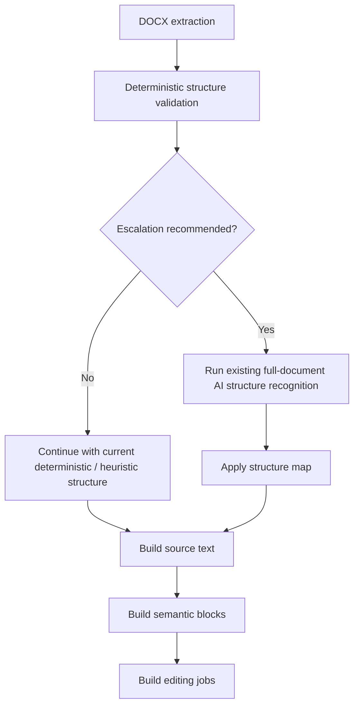

# Structure Recognition Auto Gate Spec

Date: 2026-04-18

## Goal

Introduce a practical Phase 1 auto-gated structure recognition mode:

1. the document first passes a deterministic structural validation gate
2. if the gate considers the document structurally ambiguous, the pipeline runs the existing full-document AI structure recognition stage
3. if the gate does not trigger, the pipeline continues with current deterministic/heuristic structure handling only
4. the structure-recognition model for this workstream is set to `gpt-5-mini`

This change replaces the current binary operational model:

- disabled by default via `structure_recognition.enabled = false`
- manually enabled for opt-in runs

with a more practical runtime policy:

- `off`
- `auto`
- `always`

Phase 1 is intentionally pragmatic:

- no targeted paragraph-only AI review yet
- no partial-window candidate review yet
- no dynamic model selection yet

If the gate fires, the system runs the **entire existing** structure-recognition stage.

## Problem Statement

The repository already contains a working AI structure-recognition pipeline:

1. `structure_recognition.py` builds compact paragraph descriptors
2. the model classifies paragraph roles and heading levels
3. `apply_structure_map(...)` enriches paragraph roles before semantic block construction
4. the whole stage is optional and currently protected by `structure_recognition_enabled`

However, the current behavior has a product gap:

1. in the repository baseline, structure recognition is off by default
2. enabling it requires explicit operator intent, validation profile override, or env/config override
3. the system does not currently decide for itself when a document is structurally risky
4. documents with weak DOCX semantics are not automatically escalated to AI analysis
5. the current mode is therefore too coarse: either never run AI, or always run AI

This is suboptimal because:

1. many documents are structurally clear enough without AI
2. some documents are clearly ambiguous and benefit from AI structure recognition
3. users and operators should not need to pre-classify every document manually
4. always-on AI adds avoidable cost and latency
5. manual-only opt-in leaves quality on the table for ambiguous documents

## Desired Outcome

After this specification is implemented:

1. structure recognition can operate in `auto` mode
2. `auto` mode first computes a deterministic `StructureValidationReport`
3. the report decides whether AI escalation is recommended
4. if escalation is recommended, the system runs the **existing full-document** structure recognition stage
5. if escalation is not recommended, the system skips AI and continues with current rules
6. the chosen model for the structure-recognition stage is `gpt-5-mini`
7. the system emits inspectable artifacts explaining why AI was or was not triggered

## Non-Goals

This Phase 1 specification does not include:

1. targeted paragraph-level AI review only for ambiguous candidates
2. local context windows around specific paragraphs only
3. a second AI model dedicated solely to gating
4. replacing deterministic extraction or heuristic structure handling
5. removing the existing fallback contract
6. forcing AI structure recognition on every document
7. a full benchmark harness for all model families

## Current State

Current baseline configuration:

```toml
[models.structure_recognition]
default = "gpt-5-mini"

[structure_recognition]
enabled = false
max_window_paragraphs = 1800
overlap_paragraphs = 50
timeout_seconds = 60
min_confidence = "medium"
cache_enabled = true
save_debug_artifacts = true
```

Current operational behavior:

1. extraction runs first
2. if `structure_recognition_enabled` is false, the AI stage is skipped
3. if enabled, the full-document structure-recognition stage runs
4. the pipeline then builds source text and semantic blocks
5. failure falls back to heuristic structure

Current limitation:

- the system has no automatic ambiguity gate before deciding whether to use AI

## Phase 1 Product Decision

Phase 1 adopts the following decisions:

1. add `structure_recognition.mode = "off" | "auto" | "always"`
2. use `gpt-5-mini` as the structure-recognition model for this workstream
3. in `auto` mode, run a deterministic structural gate before AI
4. if the gate triggers, execute the **entire existing** structure-recognition stage
5. keep all existing fallback behavior intact

Rationale for `gpt-5-mini` in this phase:

1. more modern than `gpt-4o-mini`
2. materially cheaper than `gpt-5.4-mini` for full-document structure classification
3. a reasonable balance of quality, cost, and latency for a whole-document structure pass
4. suitable as a Phase 1 model while the system still escalates on the full document rather than only ambiguous regions

## High-Level Design

### New runtime flow



### Mode behavior

#### `off`
- never run AI structure recognition
- behavior matches current baseline skip-path

#### `always`
- always run the existing full-document structure-recognition stage
- behavior matches current explicit opt-in path

#### `auto`
- run deterministic structure validation first
- if the gate recommends escalation, run the existing full-document structure-recognition stage
- otherwise skip AI

## Configuration Contract

### `config.toml`

Replace the Phase 0 boolean-only operational contract with an explicit mode.

Recommended Phase 1 baseline:

```toml
[structure_recognition]
mode = "auto"                 # off | auto | always
model = "gpt-5-mini"
max_window_paragraphs = 1800
overlap_paragraphs = 50
timeout_seconds = 60
min_confidence = "medium"
cache_enabled = true
save_debug_artifacts = true

[structure_validation]
enabled = true
min_paragraphs_for_auto_gate = 40
min_explicit_heading_density = 0.003
max_suspicious_short_body_ratio_without_escalation = 0.05
max_all_caps_or_centered_body_ratio_without_escalation = 0.03
toc_like_sequence_min_length = 4
forbid_heading_only_collapse = true
save_debug_artifacts = true
```

### Backward compatibility

Phase 1 must preserve compatibility with the existing boolean field during migration.

Rules:

1. if legacy `structure_recognition.enabled` is present and `mode` is absent:
   - `true` maps to `always`
   - `false` maps to `off`
2. if `mode` is present, it is canonical
3. docs and examples should prefer `mode`, not `enabled`

### `.env.example`

Recommended env surface:

```env
DOCX_AI_STRUCTURE_RECOGNITION_MODE=auto
DOCX_AI_STRUCTURE_RECOGNITION_MODEL=gpt-5-mini
DOCX_AI_STRUCTURE_VALIDATION_ENABLED=true
DOCX_AI_STRUCTURE_VALIDATION_MIN_PARAGRAPHS_FOR_AUTO_GATE=40
DOCX_AI_STRUCTURE_VALIDATION_MIN_EXPLICIT_HEADING_DENSITY=0.003
DOCX_AI_STRUCTURE_VALIDATION_MAX_SUSPICIOUS_SHORT_BODY_RATIO_WITHOUT_ESCALATION=0.05
DOCX_AI_STRUCTURE_VALIDATION_MAX_ALL_CAPS_OR_CENTERED_BODY_RATIO_WITHOUT_ESCALATION=0.03
DOCX_AI_STRUCTURE_VALIDATION_TOC_LIKE_SEQUENCE_MIN_LENGTH=4
DOCX_AI_STRUCTURE_VALIDATION_FORBID_HEADING_ONLY_COLLAPSE=true
```

## New Data Structure

Add a deterministic report object for gate evaluation.

```python
@dataclass(frozen=True)
class StructureValidationReport:
    paragraph_count: int
    nonempty_paragraph_count: int
    explicit_heading_count: int
    heuristic_heading_count: int
    suspicious_short_body_count: int
    all_caps_body_count: int
    centered_body_count: int
    toc_like_sequence_count: int
    ambiguous_paragraph_count: int
    explicit_heading_density: float
    suspicious_short_body_ratio: float
    all_caps_or_centered_body_ratio: float
    escalation_recommended: bool
    escalation_reasons: tuple[str, ...] = ()
```

The report is deterministic and must not call any model.

## Gate Heuristics

Phase 1 intentionally uses simple deterministic triggers.

AI escalation is recommended in `auto` mode when one or more of the following conditions hold.

### Trigger group 1: weak explicit structure

Escalate if:

1. `nonempty_paragraph_count >= min_paragraphs_for_auto_gate`
2. `explicit_heading_density < min_explicit_heading_density`

Interpretation:

- long-ish document
- too few explicit headings
- likely poor DOCX structural semantics

### Trigger group 2: suspicious short body paragraphs

Escalate if:

1. many short paragraphs remain classified as `body`
2. they are likely heading-like by form

Candidate examples:

- 1 to 8 words
- not list items
- not explicit captions
- not clearly attached to images/tables
- standalone or separated by body paragraphs

Interpretation:

- possible hidden headings
- possible subheads not encoded as Heading styles

### Trigger group 3: all-caps / centered ambiguity

Escalate if:

1. many `body` paragraphs are all-caps
2. many `body` paragraphs are centered
3. such paragraphs are not explicit headings

Interpretation:

- could be part titles
- could be chapter markers
- could be attribution / epigraph source
- could be false-positive heuristic headings

### Trigger group 4: TOC-like region

Escalate if:

1. a sequence of short lines resembles a contents region
2. the sequence length exceeds `toc_like_sequence_min_length`
3. current deterministic labels do not clearly explain the region

Interpretation:

- table of contents often looks flat in poor DOCX conversions

### Trigger group 5: heading-only collapse risk

Escalate if deterministic structure suggests unhealthy flattening, such as:

1. very large body runs with too few structural breaks
2. unexpectedly low heading count in a document profile expected to contain headings
3. evidence of heading-only collapse risk analogous to existing structural validation concerns

## Gate Scope

Phase 1 gate output is binary at runtime:

1. no escalation
2. escalate full document

Important Phase 1 limitation:

- even if only a subset of paragraphs appears ambiguous, the pipeline still runs the **existing full-document** structure-recognition stage

This is intentional. It avoids redesigning the current structure-recognition engine in the first practical iteration.

## Integration Plan

### New insertion point behavior in `preparation.py`

Current behavior:

1. extract document
2. optionally run structure recognition
3. build source text
4. build semantic blocks

Phase 1 behavior:

1. extract document
2. build `StructureValidationReport`
3. resolve `structure_recognition.mode`
4. decide whether AI structure recognition should run
5. if yes, run the current full-document structure-recognition stage
6. if no, continue without AI
7. build source text
8. build semantic blocks

### Decision logic

Pseudo-code:

```python
report = validate_structure_quality(
    paragraphs=paragraphs,
    image_assets=image_assets,
    relations=relations,
    app_config=app_config,
)

mode = app_config.get("structure_recognition_mode", "off")

if mode == "off":
    should_run_ai = False
elif mode == "always":
    should_run_ai = True
else:  # auto
    should_run_ai = report.escalation_recommended

if should_run_ai:
    structure_map, structure_summary = _run_structure_recognition(...)
else:
    structure_map, structure_summary = None, StructureRecognitionSummary()
```

## Progress Reporting

Add an explicit validation stage before AI escalation.

### New progress stages

Recommended preparation flow:

1. `Разбор DOCX`
2. `Структура извлечена`
3. `Структура: валидация`
4. either:
   - `Структура: детерминированно`
   - or `Распознавание структуры…`
5. `Структура распознана` or `Структура: эвристика`
6. `Текст собран`
7. `Смысловые блоки`
8. `Задания собраны`

### Stage semantics

#### `Структура: валидация`
The system computes the deterministic gate report.

#### `Структура: детерминированно`
The gate did not trigger AI escalation.

Suggested detail text:

- `Структурный риск не найден. Используются текущие правила.`

#### `Распознавание структуры…`
The gate triggered AI escalation.

Suggested detail text:

- `Найдены структурно неоднозначные участки. Запускаю AI-анализ документа.`

## Artifacts

Phase 1 must produce inspectable gate artifacts.

### New artifact directory

```text
.run/structure_validation/
```

### Artifact payload

Each gate run should write a JSON artifact similar to:

```json
{
  "mode": "auto",
  "model": "gpt-5-mini",
  "paragraph_count": 2321,
  "nonempty_paragraph_count": 1806,
  "explicit_heading_count": 26,
  "heuristic_heading_count": 41,
  "suspicious_short_body_count": 88,
  "all_caps_body_count": 14,
  "centered_body_count": 9,
  "toc_like_sequence_count": 1,
  "ambiguous_paragraph_count": 111,
  "explicit_heading_density": 0.0144,
  "suspicious_short_body_ratio": 0.0487,
  "all_caps_or_centered_body_ratio": 0.0127,
  "escalation_recommended": true,
  "escalation_reasons": [
    "toc_like_sequence_detected",
    "low_explicit_heading_density",
    "high_suspicious_short_body_ratio"
  ]
}
```

Purpose:

1. explain why AI was or was not triggered
2. make `auto` mode auditable
3. support future threshold tuning

## Model Policy For This Spec

Phase 1 structure-recognition model is:

```toml
model = "gpt-5-mini"
```

Status for this spec:

- `gpt-5-mini` is the recommended structure-recognition model for Phase 1 auto-gated rollout

Rationale:

1. modern enough to improve semantic classification quality relative to older cheap helpers
2. materially cheaper than `gpt-5.4-mini` for full-document escalation
3. better aligned with a full-document escalation approach than higher-cost mini variants
4. safer to operationalize before the system moves to targeted candidate-only review

This specification does not require changing the main text-editing model policy.

## Fallback Contract

The fallback contract remains unchanged:

1. if structure recognition is not selected, the pipeline proceeds deterministically
2. if AI structure recognition is selected but fails, the pipeline falls back to current deterministic/heuristic structure
3. the pipeline must never fail solely because structure recognition is unavailable

This means:

- `auto` mode can recommend escalation
- escalation can still fail safely
- document processing must continue

## Real-Document Validation Impact

Phase 1 should integrate with existing validation profiles.

Recommended follow-up behavior:

1. `ui-parity-default` may continue to represent non-forced baseline behavior
2. `ui-parity-ai-default` may remain as a force-enabled comparison path
3. a new profile may be introduced later for `structure_recognition.mode = "auto"`

Suggested future profile name:

- `ui-parity-structure-auto`

For Phase 1, the important part is that `auto` mode becomes testable and auditable.

## Required Code Surfaces

Implementation is expected to touch at least:

1. `config.toml`
2. `config.py`
3. `README.md`
4. `.env.example`
5. `preparation.py`
6. new gate helper location, likely:
   - `structure_validation.py`
   - or a confined section inside `preparation.py`
7. tests for config parsing and runtime decisioning
8. tests for artifacts and escalation logic

## Tests

### Required unit tests

1. parse `structure_recognition.mode = off|auto|always`
2. map legacy `enabled` to mode when `mode` is absent
3. `validate_structure_quality(...)` returns deterministic report
4. low explicit heading density triggers escalation
5. suspicious short body ratio triggers escalation
6. all-caps/centered ambiguity triggers escalation
7. TOC-like region triggers escalation
8. no-risk document does not trigger escalation

### Required preparation integration tests

1. `mode = off` never runs AI
2. `mode = always` always runs AI
3. `mode = auto` runs AI when report recommends escalation
4. `mode = auto` skips AI when report does not recommend escalation
5. progress events include `Структура: валидация`
6. gate artifacts are written when enabled
7. AI failure after escalation still falls back cleanly

### Required real-document validation checks

At minimum, Phase 1 should be exercised against the canonical large ambiguous sample:

- `tests/sources/bernardlietaer-creatingwealthpdffromepub-160516072739 ru.docx`

Expected Phase 1 interpretation for this document:

1. structurally ambiguous
2. likely triggers `auto` escalation
3. runs full-document structure recognition with `gpt-5-mini`

## Acceptance Criteria

This specification is implemented when:

1. `structure_recognition.mode` supports `off`, `auto`, and `always`
2. `gpt-5-mini` is the configured structure-recognition model in the canonical Phase 1 config examples
3. a deterministic `StructureValidationReport` exists
4. `auto` mode decides whether to run AI based on the report
5. when `auto` escalates, the system runs the **existing full-document** structure-recognition stage
6. when `auto` does not escalate, the system skips AI and continues deterministically
7. fallback behavior remains intact on AI failure
8. progress reporting distinguishes validation from escalation
9. `.run/structure_validation/` artifacts explain escalation decisions
10. config/docs/examples are aligned on the new mode-based contract

## Risks And Tradeoffs

### 1. False-positive escalation

Risk:

- the gate may trigger AI for documents that were already fine

Mitigation:

- keep thresholds conservative
- log reasons
- inspect artifacts
- tune thresholds after real-document runs

### 2. False-negative non-escalation

Risk:

- the gate may miss some weakly structured documents

Mitigation:

- keep `always` mode available
- use real-document validation to tune heuristics
- review gate artifacts on failures

### 3. Cost and latency increase in `auto`

Risk:

- some documents will now incur full-document AI structure-recognition cost

Mitigation:

- Phase 1 uses `gpt-5-mini`, not a premium mini model
- escalation is conditional, not universal
- future phases can reduce cost with targeted candidate review

### 4. Threshold brittleness

Risk:

- one heuristic profile may not fit every corpus

Mitigation:

- artifact-driven tuning
- future profile-aware thresholds if needed
- keep initial rule set small and explainable

## Summary

Phase 1 introduces a practical structure-recognition policy:

1. replace binary enablement with `off | auto | always`
2. add deterministic structural validation before AI
3. in `auto`, escalate only when structure looks ambiguous
4. when escalation happens, run the **current full-document** AI structure-recognition stage
5. use `gpt-5-mini` for that stage in this rollout

This gives the repository a better operating model than either:

- never run AI unless manually forced
- or always run AI for every document

It keeps the current architecture intact while making structure-recognition activation smarter, cheaper, and easier to explain.
